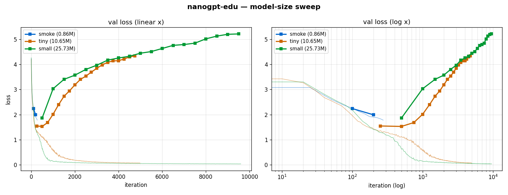
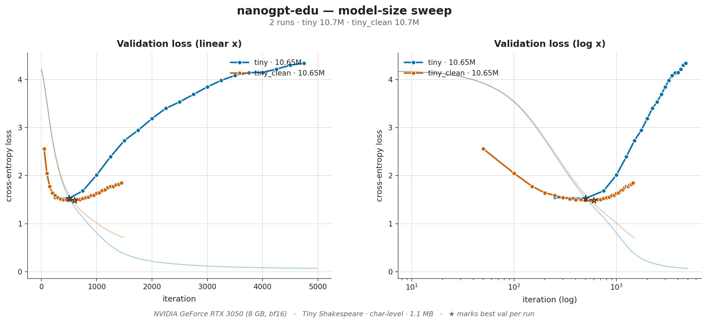
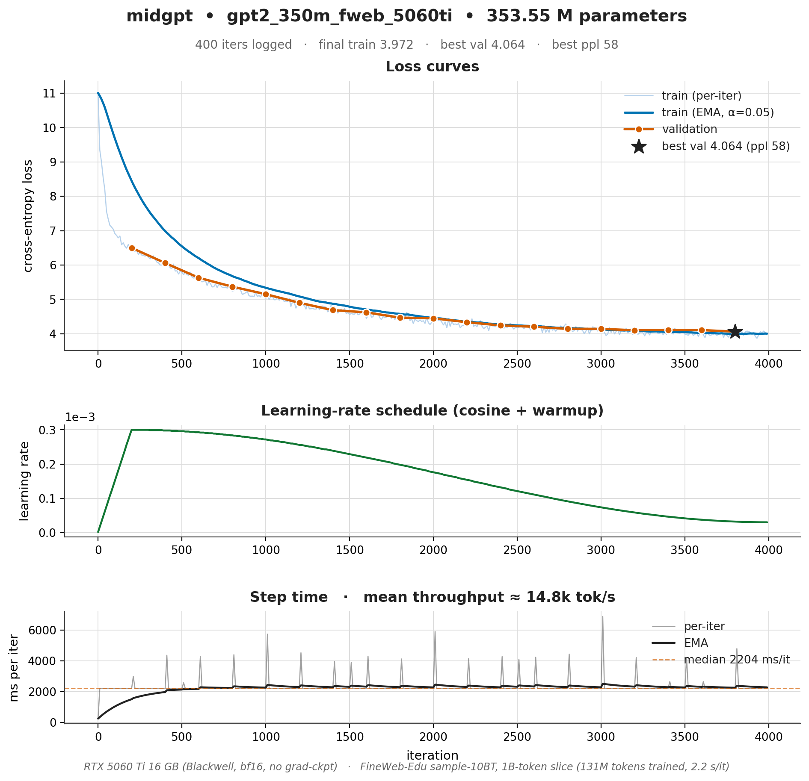
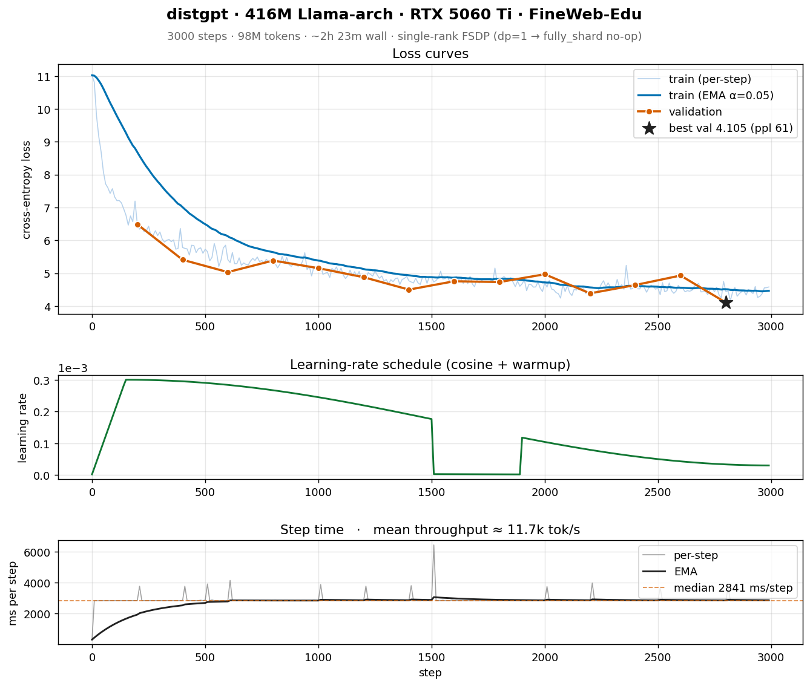
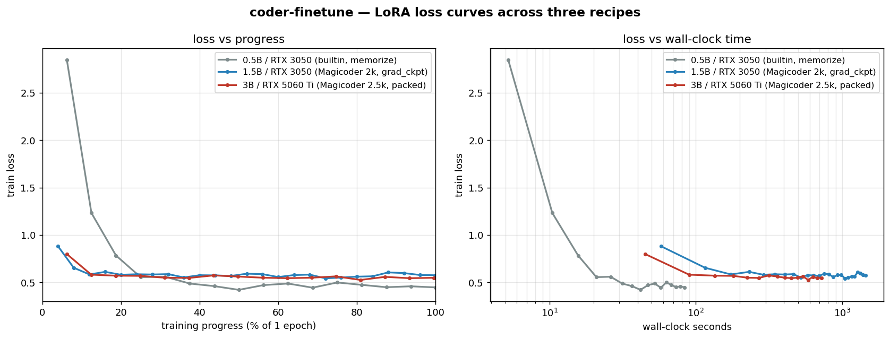
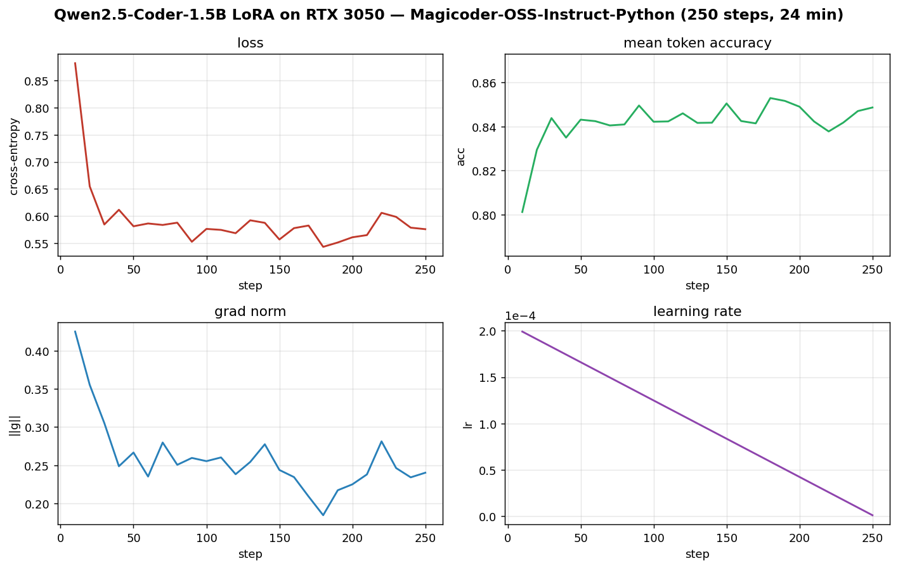

# LLM-playground

A monorepo of five self-contained PyTorch projects that walk the full
educational arc of building, training, fine-tuning, and serving GPT-class
language models — from a ~10M-parameter character-level toy you can train on
a laptop CPU, up to an architecture-only blueprint for a frontier-scale
(500B+) training platform.

Each subproject is **independent**: its own README, its own dependencies,
its own tests. Pick the one that matches the scale you care about.

## Results gallery

Three projects in this repo come with **published training plots and
headline numbers** from real single-GPU runs (one 3050, two 5060 Ti),
plus one project with a discrete-event simulator that scales the same
physics to a frontier cluster.

### `nanogpt-edu/` — real training on an RTX 3050

Three runs of a real PyTorch training loop on a single RTX 3050 (8 GB,
bf16) against char-level Tiny Shakespeare (1 MB). The whole sweep,
including a 25 M parameter model overfitting hard for 2 h, was run on a
desktop GPU at home — no cluster, no API.

| Run         | Params  | Iters         | ms/it | Wall    | Final train | **Best val** | Final val | Overfit Δ |
|-------------|--------:|--------------:|------:|--------:|------------:|-------------:|----------:|----------:|
| `smoke`     |  0.86 M | 275 / 300     |  14.0 |   ~5 s  | 1.90        | **1.99**     | 1.99      |   ~0      |
| `tiny`      | 10.65 M | 4,990 / 5,000 | 203.4 | ~17 min | 0.07        | **1.53**     | 4.34      | **2.81**  |
| `tiny_clean`| 10.65 M | 1,500 / 1,500 | 203.0 |  ~5 min | 0.53        | **1.48**     | 1.85      |   0.36    |
| `small`     | 25.73 M | 9,600 / 15,000| 798.4 | ~2 h 15 | 0.04        | **1.87**     | 5.21      |   3.35    |

The classic "best val arrives in the first ~1000 iters and then val
climbs monotonically while train collapses to zero" overfit story
(`tiny`, `small`) — and the textbook **U-shaped** counter-example
(`tiny_clean`: same architecture, `dropout=0.1`, `max_iters=1500`),
which lands on a *better* best-val while overfitting **8× less**:



Side-by-side: `tiny` (no dropout) vs `tiny_clean` (dropout 0.1) on the
same 10.65 M model and same 1 MB dataset — the only intervention is
regularization + early stopping:



Per-run 3-panel plots (loss + LR + step time) and the parser that
generated them live at [`nanogpt-edu/out/`](./nanogpt-edu/out/) and
[`nanogpt-edu/tools/plot_nanogpt.py`](./nanogpt-edu/tools/plot_nanogpt.py).
Full discussion in
[`nanogpt-edu/README.md`](./nanogpt-edu/README.md#actual-training-results-1-rtx-3050-8-gb).

### `midgpt/` — 350M GPT-2 pretraining on RTX 5060 Ti

A real from-scratch pretraining run of a **354 M-parameter GPT-2** on a
1 B-token slice of `HuggingFaceFW/fineweb-edu`, on a single **RTX 5060 Ti
16 GB (Blackwell, sm_120)**. Same code as the MPS smoke run; just scaled
up to a real GPU and a real corpus.

| Metric           | Value |
|------------------|------:|
| Model            | GPT-2 354 M (24 L × 1024 d × 16 H, tied embeddings) |
| Dataset          | FineWeb-Edu `sample-10BT`, 1 B-token slice (streamed) |
| Tokens trained   | **131 M** (~0.37× Chinchilla) |
| Wall-clock       | **2 h 27 min** (4 000 iters × 32 768 tok / step) |
| Throughput       | **14.9 k tok/s** sustained, 99 % GPU util |
| Peak VRAM        | **11.9 GB allocated / 12.8 GB reserved** (of 16 GB) |
| Train loss       | 11.00 → **3.97** |
| **Best val ppl** | **58.2** (loss 4.064) at iter 3 800 |



Three panels: train loss (raw + EMA) and validation, cosine LR
schedule, step time. The classic undertrained-Chinchilla shape — a fast
~400-iter drop as the model picks up the vocab and frequent bigrams,
then a long slow descent as it actually starts modelling text. Val
tracks train to within 0.05, no overfitting, plenty of capacity left.

Sample (T=0.7, k=50):

> *Photosynthesis is an important component of plant cell metabolism. It
> is important for the action of plants. The cell's cell activity is
> responsible for the formation of the micro-organisms…*

Fluent English, vaguely on-topic, locally coherent within ~20 tokens —
exactly what a 354 M model trained on 131 M tokens is supposed to sound
like. The plumbing is correct; the model is just undertrained. Real
GPT-2-345M (the OpenAI release) reaches val ppl ~26 on ~380× more
compute.

Recipe:
[`midgpt/configs/gpt2_350m_fweb_5060ti.yaml`](midgpt/configs/gpt2_350m_fweb_5060ti.yaml).
Walkthrough + sample completions + calibration table:
[`midgpt/examples/5060ti_350m_fineweb.md`](midgpt/examples/5060ti_350m_fineweb.md).

### `distgpt/` — 416M Llama-arch (RoPE+SwiGLU+GQA) on RTX 5060 Ti

Single-GPU shake-out of distgpt's full multi-node training stack (the
collectives no-op at world_size=1, but every other code path —
DeviceMesh, FSDP2 wrapping policy, streaming dataloader with mid-epoch
resume, DCP sharded checkpointer, SpikeMonitor + RewindController,
AdamW + cosine + per-group WD — is on the critical path).

| Metric           | Value |
|------------------|------:|
| Model            | 416 M Llama-arch (24 L × 1024 d × 16 H, **GQA 4:1**, tied embeddings, RoPE + RMSNorm + SwiGLU) |
| Dataset          | FineWeb-Edu `sample-10BT`, 1 B-token slice (shared with `midgpt/`) |
| Tokens trained   | **98 M** (~0.24× Chinchilla for 416 M) |
| Wall-clock       | **1 h 12 min** (3 000 steps × 32 768 tok / step) |
| Throughput       | **11.7 k tok/s** sustained, ~98 % GPU util |
| Peak VRAM        | **12.0 GB allocated / 12.1 GB reserved** (of 16 GB) |
| Train loss       | 11.02 → **4.58** |
| **Best val ppl** | **60.7** (loss 4.105) at step 2 800 |



The point of the run isn't to beat `midgpt/` (it doesn't — fewer tokens,
no GQA-speedup at this scale, FSDP wrapping overhead) but to **prove the
distributed-training plumbing actually trains a model**: a sharded DCP
checkpoint resumes cleanly, the streaming loader's `LoaderState` survives
restart, the spike monitor stays out of the way on a noisy small-batch
run. The writeup documents two real bugs the run surfaced — a
SpikeMonitor rewind-loop that wasted 6 hours retraining the same 100
steps in a regression loop, and why two ranks on one consumer 5060 Ti
doesn't work under NCCL 2.28 — and the fixes that landed alongside.

Recipe:
[`distgpt/configs/gpt_416m_fweb_5060ti.yaml`](distgpt/configs/gpt_416m_fweb_5060ti.yaml).
Walkthrough + bug post-mortems + 2-rank-on-one-GPU notes:
[`distgpt/examples/5060ti_416m_fineweb.md`](distgpt/examples/5060ti_416m_fineweb.md).

### `frontier-platform/` — simulated 1B → 400B program

Discrete-event simulator (pure Python, no torch) that runs the full
program end-to-end: Chinchilla-style scaling laws, MFU → throughput →
wall time, Poisson GPU failures, rolling $ accounting, eval-score
prediction, safety thresholds, serving cost models. Optional
`--real-gpu` flag probes local CUDA devices and recalibrates
`seconds_per_step` from a few real training steps so the simulated wall
clock and $ figures match the silicon you actually own.

| Run          | Cluster      | Wall    | Final loss | MMLU  | Arena ELO | **Total $**  | Throughput model |
|--------------|-------------:|--------:|-----------:|------:|----------:|-------------:|:-----------------|
| `1b`         |    64× H100  |   3.7 d |   2.21     | 50.6% |    1515   | $0.93 M      | 50% MFU × spec   |
| `7b`         |   512× H100  |   4.8 d |   2.02     | 62.7% |    1711   | $1.02 M      | 50% MFU × spec   |
| `70b`        | 4,096× H100  |  13.2 d |   1.88     | 76.8% |    1985   | $3.31 M      | 50% MFU × spec   |
| `400b`       |16,384× H100  |  54.0 d |   1.81     | 84.2% |    2142   | **$42.42 M** | 50% MFU × spec   |
| `7b_realgpu` |   512× H100  | **430.7 d** | 2.03   | 62.7% |    1711   | **$11.48 M** | RTX 3050 bf16 (measured) |

The 7B-vs-7B-realgpu comparison is the punchline: same simulated
cluster, but calibrating against an actually-measured 4.2 TFLOP/s per
RTX 3050 (vs H100's 989 TFLOP/s spec) blows wall-clock from 5 days to
14 months and cost from $1 M to $11.5 M — eval scores are identical
because scaling laws don't care how fast the GPUs are.


All five runs ship with per-run 3-panel plots (loss + cumulative $ +
cumulative failures), JSON summaries, and a reproducible CLI. See
[`frontier-platform/README.md`](./frontier-platform/README.md#simulator-results-scriptssimulatepy)
for the full story.

### `coder-finetune/` — LoRA on a single consumer GPU, three recipes

Three reproducible recipes that walk the consumer-GPU ladder, sharing
the same `transformers` + `peft` + `trl` plumbing and only differing in
model size / dataset / memory recipe. All three are 1-epoch LoRA r=16
runs against `Qwen/Qwen2.5-Coder-*`.

| Recipe | GPU | Base | Dataset | Packing | Grad-ckpt | Wall | Peak VRAM | Loss end |
|---|---|---|---|:-:|:-:|---:|---:|---:|
| `lora_3050.yaml`      | RTX 3050 8 GB    | 0.5B | builtin 320 (memorize) | ✗ | ✗ | **1m 24s** | 2.3 GB | 0.45 |
| `lora_3050_1p5b.yaml` | RTX 3050 8 GB    | 1.5B | Magicoder-Py 2k        | ✗ | ✓ | 24m 05s    | 7.5 GB | 0.58 |
| **`lora_5060ti.yaml`**| **RTX 5060 Ti 16 GB** | **3B** | **Magicoder-Py 2.5k** | **✓** | **✗** | **11m 59s** | **15.1 GB** | **0.55** |

The 5060 Ti recipe is the one to read: 2× the model in **half** the
wall-clock of the 1.5B-on-3050 push recipe, because the 16 GB budget lets
you (a) disable gradient checkpointing and (b) enable packing.



Left: training progress (% of 1 epoch). The 0.5B/builtin run drops to 0.45
because it's *memorizing* 320 short pairs — a smoke test. The two Magicoder
runs land at 0.55–0.58 (real generalization on held-out prompts; see the
5060 Ti example for Levenshtein DP, BFS, LRU cache, and a retry decorator
all generated correctly at T=0.2). Right: same losses on a log wall-clock
axis — the 5060 Ti curve sits to the left of the 1.5B-on-3050 curve at
every loss level despite training a 2× larger model.

#### 5060 Ti / 3B recipe — 12 minutes, 13.9 GB peak

[`coder-finetune/examples/5060ti_lora.md`](coder-finetune/examples/5060ti_lora.md)
walks through the headline run: `Qwen/Qwen2.5-Coder-3B` LoRA r=16 on 2,500
Python rows of `ise-uiuc/Magicoder-OSS-Instruct-75K` at seq_len=1024,
**packed**, gradient checkpointing **off**:

| Metric              | Value |
|---------------------|------:|
| Wall-clock          | **11 min 59 s** (1 epoch, 161 packed steps) |
| Peak VRAM allocated | **13.87 GB** |
| Peak VRAM reserved  | **15.10 GB** (of 16 GB) |
| Trainable params    | 29.9 M (0.96 % of 3.09 B) |
| Train loss          | 0.80 → **0.55** |
| Mean-token-acc      | 0.82 → **0.85** |
| Tokens trained      | 1.28 M |


#### 1.5B / RTX 3050 recipe — 24 minutes, 7.5 GB peak

[`coder-finetune/configs/lora_3050_1p5b.RESULTS.md`](coder-finetune/configs/lora_3050_1p5b.RESULTS.md)
documents the 8-GB limit-pusher: same Magicoder dataset, 2,000 rows,
seq_len=1024, grad-ckpt on (the 3050 has ~500 MB headroom left at that
point — without it the recipe OOMs at step 1).



#### 0.5B / RTX 3050 recipe — 84 seconds, 2.3 GB peak

[`coder-finetune/examples/3050_lora.md`](coder-finetune/examples/3050_lora.md)
is the smoke run: `Qwen/Qwen2.5-Coder-0.5B` against a 16-pair built-in
instruction set (× repeat = 320 examples). No HF dataset download required.
Loss collapses from 2.85 to 0.45 in 80 steps because it's memorizing — the
point is to validate the whole plumbing end-to-end before reaching for a
real dataset.

Plotter: [`scripts/plot_training.py`](coder-finetune/scripts/plot_training.py)
(single-run) and
[`scripts/plot_compare_recipes.py`](coder-finetune/scripts/plot_compare_recipes.py)
(cross-recipe) — both reusable for any TRL `trainer_state.json`.

## The five projects

| Project | Scale | What it teaches | Hardware |
|---|---|---|---|
| [`nanogpt-edu/`](./nanogpt-edu) | 10M–100M | A correct transformer + training loop in ~500 lines: RoPE, RMSNorm, SwiGLU, AMP, cosine LR. | 1 GPU or CPU |
| [`midgpt/`](./midgpt) | 124M–1.5B | GPT-2 scale with the real production toolbox: `tiktoken` BPE, gradient checkpointing, gradient accumulation, DDP, resumable runs, HellaSwag eval. | 1–8 GPUs, single node |
| [`distgpt/`](./distgpt) | 1B–70B | Real multi-node training: FSDP2 + Tensor Parallel + Pipeline Parallel on a 3D device mesh, sharded DCP checkpoints, loss-spike rewind, streaming dataloader. | Multi-node cluster |
| [`coder-finetune/`](./coder-finetune) | 0.5B–7B | Post-training on a single consumer GPU: full FT, LoRA, and QLoRA via HuggingFace `transformers` + `peft` + `trl`. HumanEval+ in a Docker sandbox. | 1 consumer GPU (≥6 GB) |
| [`frontier-platform/`](./frontier-platform) | 1B–500B+ | Architecture-only blueprint: data acquisition → filtering → dedup → tokenizer → pretrain → SFT → RLHF/DPO → eval → red-team → serving → observability. Interfaces + design docs; bodies are `NotImplementedError`. | Design doc; no GPUs required |

## The complexity ladder

The projects are designed to be read in order. Each one reuses the
vocabulary of the previous and adds **one** production concern:

```
nanogpt-edu  →  midgpt        →  distgpt          →  coder-finetune    →  frontier-platform
  minimal       real tokenizer    3D parallelism      post-training         the whole system
  correct       AMP / grad-ckpt   DCP checkpoints     LoRA / QLoRA          around training
  transformer   single-node DDP   spike rewind        HumanEval+
```

`coder-finetune` is the orthogonal track: instead of pretraining from
scratch, it takes pretrained weights and aligns them for code.
`frontier-platform` zooms back out to show the dozen production systems
that surround the training loop in a real frontier lab.

## Quickstart

Each subproject installs independently. There is no top-level build.

```bash
# Smallest — train a tiny GPT on TinyShakespeare in ~5 minutes
cd nanogpt-edu
python -m venv .venv && .venv/bin/pip install -r requirements.txt
.venv/bin/python prepare_shakespeare.py
.venv/bin/python train.py --config configs/tiny.py
.venv/bin/python sample.py --ckpt out/ckpt.pt --prompt "ROMEO:"
```

```bash
# GPT-2 scale on one node
cd midgpt
pip install -r requirements.txt
python prepare.py --dataset wikitext103
torchrun --standalone --nproc_per_node 8 train.py --config configs/gpt2_350m.yaml
```

```bash
# Fine-tune a code model on a consumer GPU
cd coder-finetune
pip install -r requirements.txt
python train.py --config configs/lora.yaml
python eval/run_humaneval.py --model out/lora --n-samples 1
```

```bash
# Multi-node FSDP2 + TP + PP
cd distgpt
pip install -e .
# launch via Slurm or torchrun-elastic — see distgpt/scripts/
```

```bash
# Read the blueprint
cd frontier-platform
pip install -e .
$EDITOR docs/00-overview.md
```

## Testing

Every subproject ships `pytest` smoke tests:

```bash
cd <subproject> && pytest
```

Tests run without installing the package — they use a `sys.path` shim so
you can iterate without a reinstall.

To run **everything** (pytest in each subproject + ruff at the root) in one
shot:

```bash
python3 tools/orchestrate.py            # tests + lint
python3 tools/orchestrate.py --tests    # tests only
python3 tools/orchestrate.py --lint     # lint only
python3 tools/orchestrate.py -p midgpt  # one project
```

CI mirrors this matrix in `.github/workflows/tests.yml`.

## Repository layout

```
LLM-playground/
├── nanogpt-edu/         # 10M–100M, single-file, educational
├── midgpt/              # 124M–1.5B, single-node DDP, tiktoken
├── distgpt/             # 1B–70B, multi-node FSDP2 + TP + PP
├── coder-finetune/      # 0.5B–7B, SFT / LoRA / QLoRA on HF
├── frontier-platform/   # 1B–500B+, architecture blueprint + design docs
├── tools/orchestrate.py # one-shot test+lint runner across all subprojects
├── pyproject.toml       # shared ruff config (no shared build)
├── .github/workflows/   # CI matrix: pytest each subproject + repo-wide ruff
├── JAAICODE.md          # AI-assistant project instructions
└── README.md            # this file
```

## Conventions

- Python ≥ 3.10, `from __future__ import annotations`, PEP-604 unions
  (`str | None`), built-in generics.
- `@dataclass` for configs and small value types.
- YAML configs in `configs/`; checkpoints and artefacts in `out/`.
- No cross-subproject imports — each project is deliberately standalone.

## Status

These are study projects. `nanogpt-edu`, `midgpt`, `distgpt`, and
`coder-finetune` are runnable code. `frontier-platform` is a design doc with
typed skeletons — every public function has a signature and a docstring,
but most bodies raise `NotImplementedError`. Running a real frontier model
takes thousands of GPUs and tens of millions of dollars; this repo is the
map, not the territory.

## License

See individual subprojects.
