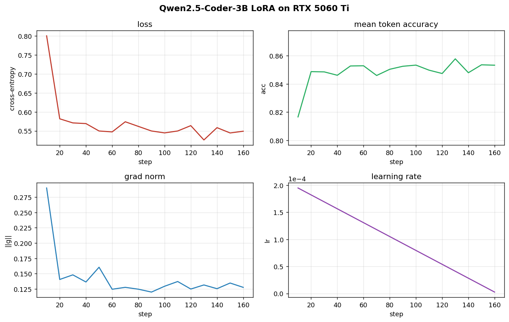

# 5060 Ti example — 12-minute LoRA of Qwen2.5-Coder-3B on Magicoder-Python

A reproducible end-to-end run on a **single RTX 5060 Ti (16 GB, Blackwell,
sm_120, native bf16)**. Trains a r=16 LoRA adapter on top of
`Qwen/Qwen2.5-Coder-3B` (the **Base** model) on 2,500 Python rows of
`ise-uiuc/Magicoder-OSS-Instruct-75K`, with packing on and gradient
checkpointing **off** — the 16 GB card lets you trade activation memory for
throughput in a way the 3050 can't.

Companion to [`3050_lora.md`](3050_lora.md): same plumbing, one tier up the
model ladder. See the [comparison table](#what-the-extra-8-gb-buys-you)
below for the diff.

## TL;DR

```bash
cd coder-finetune
.venv/bin/pip install -r requirements.txt          # one-time
CUDA_VISIBLE_DEVICES=0 .venv/bin/python train.py --config configs/lora_5060ti.yaml
.venv/bin/python infer/generate.py --model out/lora_5060ti/final \
    --prompt-style chat \
    --prompt 'Write a Python function levenshtein(a, b) that returns the edit distance between two strings.' \
    --max-new-tokens 300
```

## Headline numbers

| Metric                     | Value                |
|----------------------------|----------------------|
| GPU                        | RTX 5060 Ti 16 GB (sm_120) |
| Base model                 | Qwen/Qwen2.5-Coder-3B (3.09 B params) |
| Method                     | LoRA r=16 / α=32 (29.9 M trainable, 0.96 %) |
| Dataset                    | Magicoder-OSS-Instruct-75K, `lang=python`, 2,500 of 38,284 rows |
| Sequence length            | 1024, **packed** |
| Effective batch            | 1 × grad_accum 8 = 8 |
| Steps / epoch              | 161 (packing collapses 2,500 rows → 161 packed sequences) |
| **Wall-clock (1 epoch)**   | **11 min 59 s** (~4.5 s/step, 1,281 K tokens trained) |
| **Peak VRAM**              | **13.87 GB allocated / 15.10 GB reserved** |
| Adapter checkpoint size    | 115 MB |
| Train loss start → end     | 0.80 → **0.55** (cosine) |
| Mean token accuracy end    | 0.85 |

## Training curves



Loss / accuracy / grad-norm / LR over the 161 packed-sequence steps.
Grad-norm stays < 0.30 throughout — much tighter than the 3050/0.5B run
because (a) the model is 6× larger and (b) packed sequences average out
per-example variance. LR follows the cosine schedule from 2e-4 with 3 %
warmup.

To regenerate from a checkpoint:

```bash
.venv/bin/python scripts/plot_training.py out/lora_5060ti/checkpoint-161 \
    --title "Qwen2.5-Coder-3B LoRA on RTX 5060 Ti" \
    --out configs/lora_5060ti.training.png
```

## What the extra 8 GB buys you

Side-by-side with the two 3050 recipes (all r=16 LoRA, bf16, sdpa attention,
cosine 2e-4):

| | 3050 / 0.5B | 3050 / 1.5B | **5060 Ti / 3B** |
|---|---:|---:|---:|
| Base params           | 494 M | 1.56 B | **3.09 B** |
| Trainable (LoRA)      | 8.8 M | 18.5 M | **29.9 M** |
| Dataset               | builtin × 20 (memorize) | Magicoder Py 2 k | **Magicoder Py 2.5 k** |
| Seq len               | 512  | 1024 | **1024** |
| Packing               | off  | off  | **on** |
| Grad checkpointing    | off  | on   | **off** |
| Effective batch       | 4    | 8    | **8** |
| Steps                 | 80   | 250  | **161** (packed) |
| Tokens / step (eff)   | ~380 | 8 K  | **~8 K** |
| Wall-clock            | 1m 24s | 24m 05s | **11m 59s** |
| Peak VRAM reserved    | 2.29 GB | 7.50 GB | **15.10 GB** |
| Train loss end        | 0.45 (overfit) | 0.58 | **0.55** |

Two things change qualitatively going from the 3050/1.5B recipe to the
5060 Ti/3B recipe:

1. **Packing flips on.** Magicoder examples average ~400 tokens; at
   seq_len=1024 the unpacked recipe wastes ~60 % of each forward pass on
   padding. Packing concatenates examples into dense 1024-token sequences,
   roughly halving the step count without changing the optimizer recipe.
   It needs ~1 GB more peak activation memory, which the 3050 doesn't have
   to spare but the 5060 Ti does.

2. **Gradient checkpointing flips off.** With the activation memory
   budget freed up, you can drop the recompute penalty (~30 % of forward
   FLOPs on Qwen2). Combined with packing, the result is **2× the model
   size in half the wall-clock** versus the 3050/1.5B recipe.

## Sample completions

Trained on Magicoder ChatML turns, so `--prompt-style chat` works directly
even though the base is the non-Instruct variant — the LoRA teaches the
ChatML format alongside the Python.

### `levenshtein(a, b)`

```python
def levenshtein(a, b):
    """Calculate the edit distance between two strings."""
    m, n = len(a), len(b)
    dp = [[0] * (n + 1) for _ in range(m + 1)]

    for i in range(m + 1):
        dp[i][0] = i
    for j in range(n + 1):
        dp[0][j] = j

    for i in range(1, m + 1):
        for j in range(1, n + 1):
            if a[i - 1] == b[j - 1]:
                dp[i][j] = dp[i - 1][j - 1]
            else:
                dp[i][j] = min(dp[i - 1][j], dp[i][j - 1], dp[i - 1][j - 1]) + 1

    return dp[m][n]
```

Textbook bottom-up DP. Correct base cases, correct recurrence, O(m·n) time
and space.

### `bfs_shortest_path(graph, start, goal)`

```python
from collections import deque

def bfs_shortest_path(graph, start, goal):
    queue = deque([(start, [start])])
    visited = set()

    while queue:
        current, path = queue.popleft()
        if current == goal:
            return path
        if current not in visited:
            visited.add(current)
            for neighbor in graph[current]:
                queue.append((neighbor, path + [neighbor]))

    return None
```

Standard BFS with path-carry. The model also produced a correct
"time O(V+E), space O(V)" complexity analysis as a follow-up sentence.

### `LRUCache`

```python
from collections import OrderedDict

class LRUCache:
    def __init__(self, capacity):
        self.capacity = capacity
        self.cache = OrderedDict()

    def get(self, key):
        if key in self.cache:
            self.cache.move_to_end(key)
            return self.cache[key]
        return -1

    def put(self, key, value):
        if key in self.cache:
            self.cache.move_to_end(key)
        self.cache[key] = value
        if len(self.cache) > self.capacity:
            self.cache.popitem(last=False)
```

The canonical `OrderedDict.move_to_end` / `popitem(last=False)` recipe.
O(1) on both ops, modulo OrderedDict's amortized hashing.

### `@retry(n_tries, exceptions=...)` decorator

```python
import functools

def retry(n_tries, exceptions=(Exception,)):
    def decorator(func):
        @functools.wraps(func)
        def wrapper(*args, **kwargs):
            for _ in range(n_tries):
                try:
                    return func(*args, **kwargs)
                except exceptions as e:
                    print(f"Retrying {func.__name__} due to {e}")
            raise Exception(f"{func.__name__} failed after {n_tries} tries")
        return wrapper
    return decorator
```

Correctly nested three-level decorator with `functools.wraps`. None of these
four problems are in the training set; they're sampled at T=0.2 from the
adapter and run as-is.

> **Tail noise.** Every completion has a few stray non-ASCII tokens
> (`ซ่า`, `寧`, etc.) before the `<|im_end|>` stop, which is a Qwen2.5
> Base-model artifact, not the LoRA's fault. They're after the answer, so
> the code is unaffected, but you'd strip them in production by trimming
> at the first code-fence close.

## What this teaches vs. doesn't

**Teaches:**
- A real LoRA on a real instruction dataset (not memorization). The held-out
  prompts above weren't in the 2,500 rows the adapter saw.
- The 16 GB-vs-8 GB design space: when you can afford to disable gradient
  checkpointing and turn on packing, you get nearly 2× throughput at the
  cost of ~2× peak memory.
- That a 30 M-param adapter (0.96 % of the 3B base) is enough to teach a
  Base model both the Magicoder ChatML response format *and* clean Python
  on novel prompts, in 12 minutes of training.

**Doesn't teach:**
- A pass@1 number on HumanEval+. Wire that in via
  `python eval/run_humaneval.py --model out/lora_5060ti/final --n-samples 1`
  — expect ~5–8 minutes for n=164 problems.
- Multi-epoch / multi-dataset scheduling. Real coder fine-tunes mix
  Magicoder + Evol-Instruct + a smaller eval set; this recipe is one
  epoch on one source for clarity.
- Long context. seq_len=1024 is fine for Magicoder; the same recipe at
  seq_len=4096 would OOM at the current packing setting (drop bs to 1
  unpacked + grad_ckpt on, like the 1.5B-on-3050 recipe).

## Reproducing

```bash
cd coder-finetune
rm -rf out/lora_5060ti
CUDA_VISIBLE_DEVICES=0 .venv/bin/python train.py --config configs/lora_5060ti.yaml
```

The 3B base weights are ~6 GB (one-time download on first run, cached at
`~/.cache/huggingface/hub/`). The Magicoder dataset is ~150 MB. After that
the training step is fully offline.

Drop-in alternatives to try:
- `model.name: Qwen/Qwen2.5-Coder-3B-Instruct` — start from the Instruct
  variant for cleaner trailing-token behavior.
- `dataset.max_examples: 10000` — ~50-minute run, tighter loss curve.
- `train.batch_size: 2` with `gradient_checkpointing: true` — bumps eff-batch
  to 16 at roughly the same VRAM ceiling.

## Files

```
configs/lora_5060ti.yaml          # the recipe
configs/lora_5060ti.training.png  # 2×2 curves: loss / acc / grad-norm / lr
out/lora_5060ti/
├── train.log                     # human-readable run log (no progress bars)
├── train.jsonl                   # one JSON object per log_every step
└── final/                        # saved adapter (115 MB)
    ├── adapter_config.json
    ├── adapter_model.safetensors
    ├── chat_template.jinja
    ├── tokenizer.json
    └── tokenizer_config.json
```
