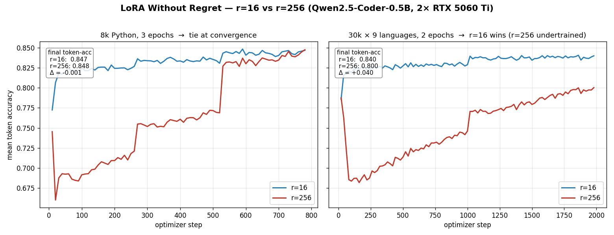

# LoRA Without Regret — r=16 vs r=256, measured

**What:** a controlled A/B testing the central claim of *LoRA Without Regret*
(Schulman et al., TML 2025) — that a high-rank LoRA **matches** a low-rank one
(and, by extension, full fine-tuning) once the adapter has enough capacity *and
enough steps* — on real hardware (2× RTX 5060 Ti).

**TL;DR — three runs, one sharpening lesson:**

- **8k Python, 1 epoch → r=16 wins** (token-acc 0.827 vs 0.760): the 16×-larger
  r=256 adapter is undertrained, still climbing at the epoch boundary.
- **8k Python, 3 epochs → dead heat** (0.8469 vs 0.8476): given the steps its
  capacity needs, r=256 *matches* r=16 — the thesis ("no regret," not "free
  lunch": you pay 16× the params for parity, not a win).
- **30k × 9 languages, 2 epochs → r=16 wins again** (0.840 vs 0.800, and the only
  arm that writes correct held-out Rust/TS): a bigger, harder dataset did **not**
  flip it, because it also gave the big adapter more to learn in the same budget.
- **The binding constraint is training *budget*, not dataset size.** r=256's slow
  warmup means that at every fixed epoch count we tried (1/2/3 epochs) it ties or
  trails r=16. The separation the paper predicts (r=256 > r=16) is real but lives
  at **iso-convergence on a 24 GB+ / multi-epoch budget** — a sizing fact, not a
  minimal-tier result.
- **Methodology that transfers:** compare LoRA ranks at iso-*convergence*, not
  iso-epoch; and trust token-accuracy over `train_loss` (which the rsLoRA
  `alpha/√r` scaling makes incomparable across ranks).
- **The arms genuinely differ only in rank.** Same base (Qwen2.5-Coder-0.5B),
  same data, same LR (2e-4, *not* lowered for rank — finding #3), same effective
  batch (16 < 32 — finding #4), both all-linear (finding #1). The only deltas:
  `r` (16 vs 256) and `use_rslora` (the `alpha/√r` scaling the high-rank arm
  needs).

---

## Setup



*Left: 8k Python, 3 epochs — r=256 (red) dips on warm-up then climbs to a tie
with r=16 (blue). Right: 30k × 9 languages, 2 epochs — r=256 shows the same dip
but never catches r=16 within the epoch budget. Generated by
`scripts/plot_lora_ab.py`.*

Two configs identical except rank: [`configs/ab_lora_r16.yaml`](../configs/ab_lora_r16.yaml)
and [`configs/ab_lora_r256.yaml`](../configs/ab_lora_r256.yaml) (1 epoch), plus
their `*_3ep.yaml` siblings (3 epochs). Run concurrently, one arm per GPU:

```bash
# 1-epoch arms (the "undertrained high-rank" datapoint)
CUDA_VISIBLE_DEVICES=0 python train.py --config configs/ab_lora_r16.yaml
CUDA_VISIBLE_DEVICES=1 python train.py --config configs/ab_lora_r256.yaml

# 3-epoch arms (the fair, converged comparison)
CUDA_VISIBLE_DEVICES=0 python train.py --config configs/ab_lora_r16_3ep.yaml
CUDA_VISIBLE_DEVICES=1 python train.py --config configs/ab_lora_r256_3ep.yaml
```

| | **Arm A — r=16** | **Arm B — r=256** |
|---|---|---|
| trainable params | 8.8 M (1.75 %) | 141 M (22.2 %) |
| scaling | `alpha/r` (standard) | `alpha/√r` (rsLoRA) |
| target modules | all-linear (q/k/v/o + gate/up/down) | all-linear (identical) |
| LR | 2e-4 | 2e-4 (identical) |
| effective batch | 16 | 16 (identical) |
| peak VRAM | 4.8 GB | 7.2 GB |

Both on Qwen2.5-Coder-0.5B, 8 000 Magicoder-OSS-Instruct Python rows, seq 1024,
packing on.

---

## Result 1 — 1 epoch: r=16 wins (because r=256 is undertrained)

| Metric (1 epoch) | r=16 | r=256 |
|---|---:|---:|
| final train loss | **0.694** | 1.587 |
| final mean-token-accuracy | **0.827** | 0.760 |
| token-acc trajectory | 0.78 → **0.83** (plateaus fast) | 0.58 → 0.76 (**still climbing**) |
| wall-clock | 607 s | 685 s |

At one epoch the small adapter has already saturated while the big one is barely
halfway up its curve. If you stopped here you'd "prove" low rank wins — and
you'd be wrong, because you simply didn't train the high-rank adapter enough.
The monotonic, non-flattening r=256 curve is the tell.

## Result 2 — 3 epochs: r=256 catches up to a dead heat

| Metric (3 epochs) | r=16 | r=256 |
|---|---:|---:|
| final train loss | 0.642 | 0.964 |
| **final mean-token-accuracy** | **0.8469** | **0.8476** |
| token-acc trajectory | 0.77 → 0.84 (smooth) | 0.75 → **0.70 dip** → 0.85 (warms up, then steep) |

Given the steps its capacity needs, **r=256 matches r=16 on the scaling-invariant
metric (token accuracy)**. Held-out generations confirm both produce correct
code (e.g. a clean Levenshtein DP from the r=16 arm).

> **Why `train_loss` disagrees with token-accuracy.** The r=256 arm reports a
> higher *loss* (0.96 vs 0.64) but the *same* token accuracy. That's the rsLoRA
> `alpha/√r` scaling + the run-average nature of `train_loss` (it includes the
> r=256 arm's long warmup dip), **not** a quality gap. Token accuracy — measured
> per-step on the actual next-token prediction — is the honest convergence
> signal, and it says the arms are tied.

---

## Result 3 — bigger, harder dataset (30k, 9 languages, 2 epochs): r=16 *wins*

The natural next test of finding #2: does a **capacity-exceeding** mixture finally
make r=256 pull ahead? We swapped the 8 k Python-only set for **30 k shuffled rows
spanning all 9 Magicoder languages** (python/shell/ts/cpp/rust/php/java/swift/csharp)
— r=16 now has to compress nine languages' idioms into 8.8 M params. Two epochs,
one arm per GPU.

| Metric (30k multi-lang, 2 epochs) | r=16 | r=256 |
|---|---:|---:|
| final mean-token-accuracy | **0.840** | 0.800 |
| mean token-acc (last 5 logs) | **0.838** | 0.798 |
| min token-acc (warmup dip) | 0.786 | **0.682** |
| held-out Rust GCD | ✅ correct Euclid | ❌ garbage (`result*remainder`) |
| held-out TS reverseString | ✅ correct | ❌ broken (`.map(s=>s.reverse())`) |

**r=16 wins outright** — higher token accuracy *and* the only arm that produces
correct held-out code in languages it was trained on. r=256 is **still
undertrained**: its curve shows the same warmup dip (down to 0.68) and is *still
climbing* at the 2-epoch boundary (0.79 → 0.80 in the last logs), never catching
r=16.

**The lesson sharpens.** Making the dataset bigger/harder did **not** flip the
result the way "give the adapter enough capacity for the dataset" might suggest —
because it also gave the 16×-larger adapter **more to learn in the same epoch
budget**. The binding constraint here is **training budget, not dataset size**:
r=256 needs substantially more steps to converge, and at any fixed epoch count we
tried (1, 2, 3 epochs) its slow warmup leaves it tied-or-behind. The separation
the paper predicts (r=256 > r=16) is real, but it lives at **iso-convergence on a
24 GB+ / multi-epoch budget**, not iso-epoch on the minimal tier — a genuine
*sizing fact*, and the most honest thing this hardware can show.

---

## The reading (all three results)

This A/B reproduces *LoRA Without Regret*'s core claim and its most important
caveat at the same time:

- **The claim (finding #2):** with enough capacity **and steps**, high-rank LoRA
  reaches the same quality — there's no inherent penalty for the bigger adapter.
  Here r=256 ties r=16 at 3 epochs.
- **The caveat (the trap):** high rank is **slower to converge** (16× the params
  to move), so a fixed *epoch* budget under-trains it and makes low rank look
  better than it is. The fair comparison is iso-*convergence*, not iso-epoch.

**So when is r=256 actually worth it?** Not at any budget this hardware reached:
on 8 k rows r=16 already has the capacity (they tie at 3 epochs), and on 30 k × 9
languages r=16 still *wins* at 2 epochs because r=256 hasn't converged. The
paper's r≈256 recommendation lives where r=16 plateaus *below* r=256 **and** you
can afford to train the big adapter to convergence — i.e. iso-*convergence* on a
24 GB+ card or a many-epoch budget on a 100 k+ mixture. On the minimal tier, the
transferable lesson is the **methodology**: compare LoRA ranks at iso-convergence
(not iso-epoch), trust token-accuracy over `train_loss`, and remember the big
adapter's slow warmup is a real cost you pay up front.

---

## Reproduce

```bash
# 8k Python — parity at 3 epochs (≈30 min each on a 5060 Ti)
CUDA_VISIBLE_DEVICES=0 python train.py --config configs/ab_lora_r16_3ep.yaml &
CUDA_VISIBLE_DEVICES=1 python train.py --config configs/ab_lora_r256_3ep.yaml &
wait

# 30k × 9 languages — r=16 still wins at 2 epochs (≈90 min each)
CUDA_VISIBLE_DEVICES=0 python train.py --config configs/ab_lora_r16_sep.yaml &
CUDA_VISIBLE_DEVICES=1 python train.py --config configs/ab_lora_r256_sep.yaml &
wait
# token-accuracy lives in out/<run>/checkpoint-*/trainer_state.json (log_history)
python scripts/plot_lora_ab.py   # -> examples/lora_without_regret_ab.png
```

The four LoRA-Without-Regret findings are pinned in
`tests/test_lora_without_regret.py` so the configs can't silently drift back to
attention-only / lowered-LR / high-rank-RL. The `dataset.shuffle` knob (used by
the `*_sep` configs to sample all 9 languages, not just the Python head) is in
`cf_data.load_hf`.

**Caveat (scale).** Qwen-0.5B at ≤2 epochs is the minimal tier; it shows *parity
and the undertraining trap*, not the r=256 > r=16 *separation* that needs the big
adapter trained to convergence. That separation is the ideal-tier follow-up.
