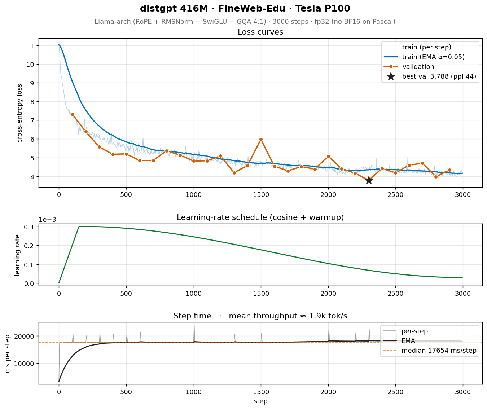

# distgpt — Distributed multi-node training framework

Real code (not pseudocode) for training **1B–70B** parameter GPTs across **multiple nodes** with:

- **FSDP2** (PyTorch native) full sharding of params + grads + optimizer state
- **Tensor Parallelism** via `torch.distributed.tensor` DTensor (column/row parallel linears)
- **Pipeline Parallelism** via `torch.distributed.pipelining` (1F1B schedule)
- **Sequence Parallelism** for memory savings on long context
- **Sharded distributed checkpointing** (DCP) — reshardable across topologies
- **Activation checkpointing** (selective or full)
- **Mixed precision** (BF16 + FP32 master)
- **Streaming dataloader** with deterministic per-rank, mid-epoch resume
- **Eval harness** (lm-eval-harness compatible)
- **W&B + JSONL logging**, loss-spike monitor, async checkpoint upload
- **Slurm + torchrun-elastic** launchers

This code is real and self-consistent. It will not actually finish a 70B run on your laptop — you need a cluster. But every code path is implemented, not stubbed.

## Layout

> **Recent additions:** Muon optimizer (with opt-in decoupled `weight_decay`
> and `update_scale` knobs; defaults reproduce the prior update bit-for-bit),
> Liger fused linear-CE, Transformer
> Engine FP8 path, Megatron-style sequence parallelism, HuggingFace export
> + lm-evaluation-harness CLI, recipe configs (cooldown / longctx / Muon
> speedrun / **DeepSeek-V3-style**), warm-start checkpoint loading,
> **2025-frontier architecture** primitives (sparse MoE FFN with shared
> expert + aux-loss-free balancing; Multi-head Latent Attention with
> 5–10× KV-cache compression; Multi-Token Prediction auxiliary heads).
> All default-off; see
> [`docs/improvements_2026q1.md`](docs/improvements_2026q1.md) for what
> landed, why, and which latent bugs got caught along the way.

```
distgpt/
├── distgpt/
│   ├── model/
│   │   ├── config.py          # ModelConfig with param_count() + active_param_count()
│   │   ├── transformer.py     # GPT (RoPE, RMSNorm, SwiGLU, GQA, MLA, MoE, MTP)
│   │   └── parallel_layers.py # ColumnParallelLinear, RowParallelLinear, VocabParallelEmbedding
│   ├── parallel/
│   │   ├── mesh.py            # 3D device mesh (dp, tp, pp)
│   │   ├── fsdp.py            # FSDP2 wrapping policy
│   │   ├── tensor.py          # TP application via parallelize_module
│   │   └── pipeline.py        # PP stage building + schedule
│   ├── data/
│   │   ├── streaming.py       # iterable, resumable shard reader
│   │   └── mixture.py         # weighted multi-source sampler
│   ├── training/
│   │   ├── optim.py           # AdamW + cosine + per-group WD
│   │   ├── checkpoint.py      # DCP sharded save/load (reshardable)
│   │   ├── stability.py       # SpikeMonitor + RewindController
│   │   └── trainer.py         # the loop
│   ├── eval/
│   │   └── harness.py         # ppl + downstream tasks
│   ├── utils/
│   │   ├── logging.py         # JSONL + W&B + rank-zero filter
│   │   └── dist.py            # init/destroy, all_reduce helpers
│   └── cli.py                 # `distgpt train|eval|sample`
├── configs/                   # 1B / 7B / 70B YAML
├── scripts/                   # slurm + torchrun launchers
└── tests/                     # unit tests (single-process where possible)
```

## Reference topologies

| Model | GPUs       | DP | TP | PP | ZeRO | Activation | Throughput target  |
|-------|-----------:|---:|---:|---:|-----:|-----------|--------------------|
| 1B    | 8× H100    | 8  | 1  | 1  | FSDP-3 | none      | 250k tok/s         |
| 7B    | 64× H100   | 8  | 1  | 1  | FSDP-3 | selective | 1.5M tok/s         |
| 7B    | 64× H100   | 4  | 8  | 1  | ZeRO-1 | selective | 1.6M tok/s         |
| 70B   | 512× H100  | 8  | 8  | 8  | ZeRO-1 | selective | 6M tok/s           |

## Quickstart (single node, 8 GPUs, FSDP only)

```bash
pip install -r requirements.txt
# Tokenize some data (or symlink a directory of *.bin uint16 shards)
python -m distgpt.data.prepare_dummy --out data/tiny --tokens 50000000

torchrun --standalone --nproc_per_node 8 -m distgpt.cli train \
    --config configs/1b.yaml --data data/tiny
```

## Multi-node via Slurm

```bash
sbatch scripts/slurm_70b.sbatch
```

## Worked example — 416 M Llama-arch on a single RTX 5060 Ti

For a single-GPU shake-out of the full stack (model + 3D mesh + streaming
loader + DCP checkpointing + spike monitor + AdamW/cosine), there's a
real reproducible run in [`examples/5060ti_416m_fineweb.md`](examples/5060ti_416m_fineweb.md):

- 416 M params · Llama-arch (RoPE + RMSNorm + SwiGLU + GQA 4:1)
- FineWeb-Edu 1 B-token slice · seq 1024 · effective batch 32 768 tokens
- **1 h 12 min** wall-clock · **11.7 k tok/s** · **12.0 GB** peak VRAM
- **Val ppl 60.7** at step 2 800 (98 M tokens trained, ~0.24× Chinchilla)


Config: [`configs/gpt_416m_fweb_5060ti.yaml`](configs/gpt_416m_fweb_5060ti.yaml).
The writeup also documents two real bugs this run surfaced (a
SpikeMonitor rewind-loop on noisy small-batch gradients, and why running
two ranks on one consumer GPU doesn't work under NCCL 2.28) and the
fixes that landed in the same commit.

## Worked example — same model on a 2016 Tesla P100

The same 416 M model trained on a **single Tesla P100-PCIE-16GB** (Pascal,
sm_60, no Tensor Cores, no BF16). See [`examples/p100_416m_fineweb.md`](examples/p100_416m_fineweb.md):

- Identical config to the 5060 Ti run, only `dtype` (bf16 → fp32) and
  `micro_batch`/`grad_accum` (4/8 → 2/16) changed
- **14 h 50 min** wall-clock · **1.85 k tok/s** · **12.7 GB** peak VRAM
- **Val ppl 44.2** at step 2 300 (~12× slower than the 5060 Ti, but lower
  held-out loss thanks to fp32 precision)



Config: [`configs/gpt_416m_fweb_p100.yaml`](configs/gpt_416m_fweb_p100.yaml).
The writeup documents three more real issues this run surfaced
(CUDA 13 dropped sm_60 from the default torch wheel, a
half-broken Blackwell GPU in the same host poisoning `cuInit`, and why
the framework's bf16-only design NaNs on Pascal fp16) plus the
sidecar `.venv-pascal/` and PCI-unbind workarounds that got it running.

## What's *not* in scope

- Custom CUDA kernels (we lean on PyTorch SDPA + Transformer Engine if installed)
- Expert parallelism mesh + `all_to_all` dispatch for MoE+TP (the MoE
  layers themselves are in, but tp=1 only — Tier 6)
- Custom MLA+TP sharding plan (the MLA layer is in, tp=1 only — Tier 6)
- HuggingFace export adapters for MoE (Mixtral format) or MLA (DeepSeek
  custom class) — both exports raise `NotImplementedError` rather than
  silently produce a broken model
- RLHF (see the `frontier-platform` blueprint)
- Inference engine (use vLLM / TRT-LLM)
