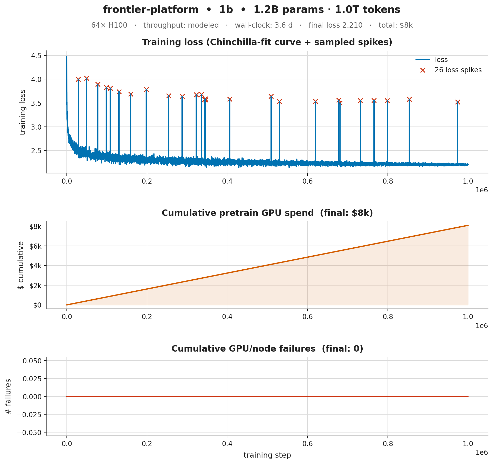
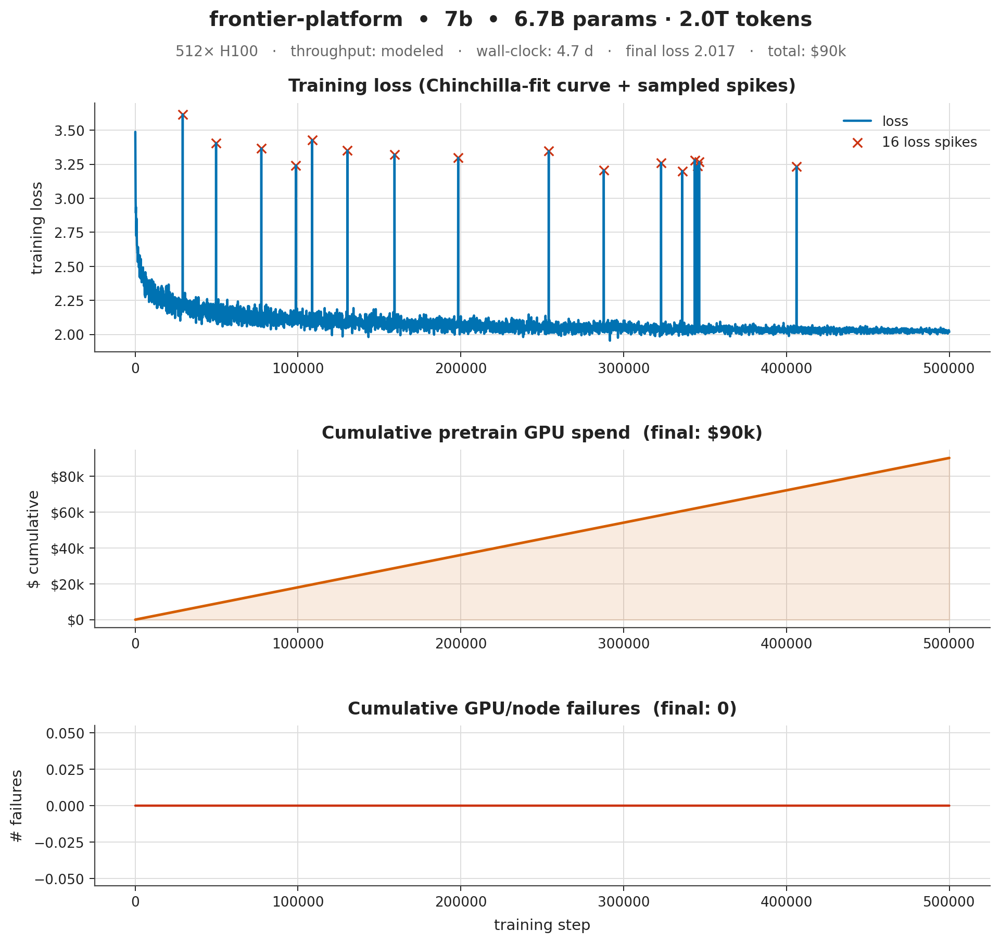
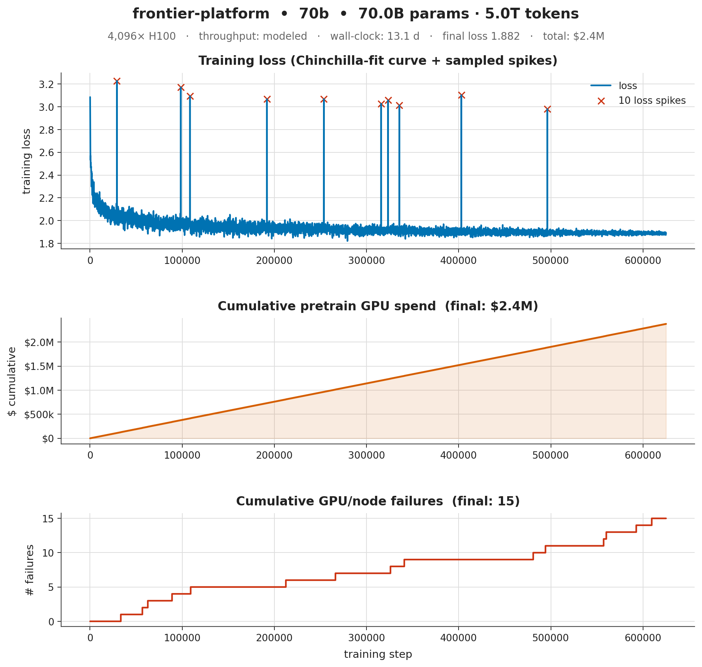
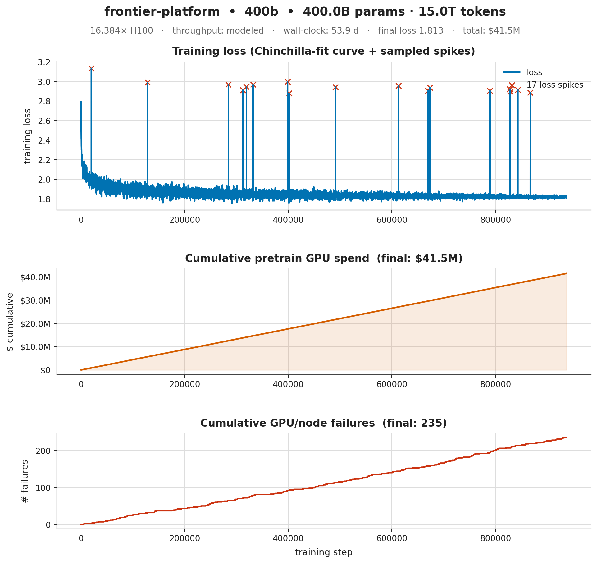
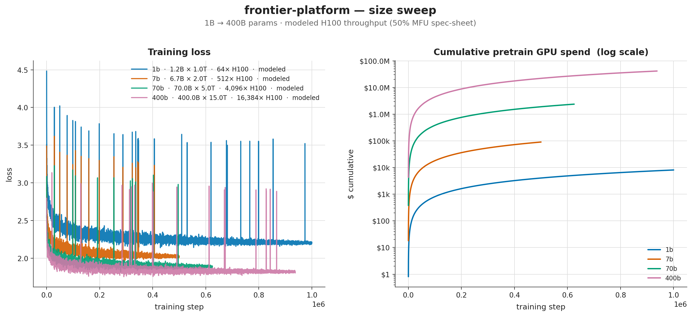
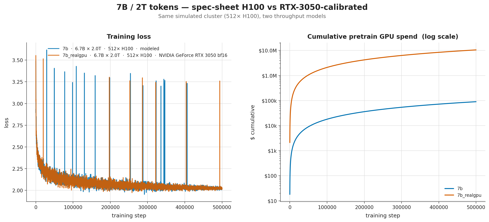

# Frontier Model Training Platform

A design-doc + skeleton-code blueprint for an end-to-end system capable of training, aligning, evaluating, and serving GPT-class frontier models (1B–500B+ parameters).

This repository is **architecture-only**. It defines interfaces, module boundaries, infrastructure assumptions, and reference implementations stubbed at the function-signature level. It does *not* perform real training — that requires a multi-thousand-GPU cluster, $10M–$500M of compute, and a dedicated team.

## Why this exists

Training a frontier LLM is not one problem; it is roughly a dozen production systems glued together. Most public "train your own GPT" repos cover only step 3 (pretraining) at toy scale. This blueprint covers all of:

```
  raw web  →  data pipeline  →  pretraining  →  midtraining  →  SFT  →  preference data  →  RLHF/DPO  →  eval  →  red-team  →  serving  →  telemetry → (back to data)
```

## Layout

```
frontier-platform/
├── docs/                 # Design docs — read these first
│   ├── 00-overview.md
│   ├── 01-data-pipeline.md
│   ├── 02-tokenizer.md
│   ├── 03-model-architecture.md
│   ├── 04-pretraining.md
│   ├── 05-distributed-training.md
│   ├── 06-checkpointing.md
│   ├── 07-alignment-sft-rlhf.md
│   ├── 08-evaluation.md
│   ├── 09-safety-redteam.md
│   ├── 10-serving-inference.md
│   ├── 11-infrastructure.md
│   ├── 12-cost-and-scaling-laws.md
│   ├── 13-simulation.md     # ← discrete-event simulator
│   ├── 14-gap-analysis-vs-frontier.md  # ← where this blueprint trails GPT-5.x/Opus 4.x/Gemini 3.x
│   ├── 15-reasoning-rl-rlvr.md          # ← RLVR/GRPO design stub (gap #1) + sim phase
│   └── 16-multimodality.md              # ← multimodal design stub (gap #2) + toy VLM
├── platform/             # Skeleton Python packages
│   ├── data/             # ingestion, dedup, filter, mix, shard
│   ├── tokenizer/        # BPE training + serving
│   ├── model/            # transformer, attention variants, MoE, vision (toy VLM)
│   ├── training/         # pretraining loop, optimizer, parallelism
│   ├── alignment/        # SFT, reward model, PPO, DPO
│   ├── rl/               # RLVR: verifiers + group rollout + GRPO + self-play (reasoning post-train)
│   ├── sim/              # discrete-event program simulator (MoE/FP8/RLVR economics)
│   ├── eval/             # benchmark harness
│   ├── safety/           # classifiers + red-team harness
│   ├── serving/          # inference server, KV-cache, batching
│   └── infra/            # cluster, scheduler, storage, observability
├── configs/              # YAML configs per model size (1B / 7B / 70B / 400B)
├── scripts/              # entry-point CLIs
└── tests/                # smoke tests for the skeletons
```

## Reading order

1. `docs/00-overview.md` — system diagram and team/cost realities
2. `docs/12-cost-and-scaling-laws.md` — what you are signing up for
3. `docs/01-data-pipeline.md` through `docs/11-infrastructure.md` in order
4. `platform/*/README.md` for each subsystem
5. `docs/14-gap-analysis-vs-frontier.md` — honest gaps vs 2025–2026 flagships
   (GPT-5.x / Opus 4.x / Gemini 3.x), then `15-reasoning-rl-rlvr.md` and
   `16-multimodality.md` for the two capability-defining gaps

## Status

| Subsystem        | Design doc | Skeleton code | Tests |
|------------------|:---------:|:-------------:|:-----:|
| Data pipeline    | ✅        | ✅            | smoke |
| Tokenizer        | ✅        | ✅            | smoke |
| Model            | ✅        | ✅            | smoke |
| Pretraining      | ✅        | ✅            | smoke |
| Alignment        | ✅        | ✅            | smoke |
| RLVR / reasoning | ✅        | ✅ (toy)      | smoke |
| Multimodality    | ✅ (stub) | ✅ (toy VLM)  | smoke |
| Evaluation       | ✅        | ✅            | smoke |
| Safety           | ✅        | ✅            | —     |
| Serving          | ✅        | ✅            | smoke |
| Infra            | ✅        | ✅            | —     |
| Program simulator| ✅        | ✅ (MoE/FP8/RLVR) | smoke |

## What works today

- ✅ Tier 1 — **data pipeline**: acquire local files, extract, filter, dedup, decontaminate, shard, mix, stream-load (resumable).
- ✅ Tier 1 — **tokenizer**: bytes-level (stdlib) + optional HF BPE.
- ✅ Tier 1 — **safety**: classifiers, gates, red-team toy suite. **Infra**: cluster, local scheduler, observability.
- ✅ Tier 1 — **eval**: in-process perplexity + arena ELO.
- ✅ Tier 2 — real **Transformer** (RoPE / RMSNorm / SwiGLU / GQA / MoE) with muP-style init.
- ✅ Tier 2 — **training**: AdamW (WD-by-dim), cosine+warmup LR, single-process ParallelEngine, DCP-style checkpointing, SpikeMonitor + RewindController, `Trainer.fit`.
- ✅ Tier 2 — **serving**: in-process `TorchEngine` with streaming generate, router.
- ✅ Tier 3 — **alignment**: SFT (assistant-token loss mask), BT reward model, DPO (sigmoid / IPO / KTO variants), PPO with GAE + KL-to-reference penalty + clipped objective + value head.
- ✅ Tier 3 — **RLVR / reasoning** (`platform/rl/`, toy-functional): verifiable reward functions (math exact-answer, string/regex, length penalty; sandboxed code-test verifier stubbed), group rollout, **GRPO** (value-network-free, group-relative advantages + KL-to-reference), and a deterministic **self-play / evolutionary loop** (`selfplay.py`: evaluate → keep top-k → mutate → repeat, an AlphaEvolve/SPIN-shaped closed loop over policy callables). See `docs/15-reasoning-rl-rlvr.md`.
- ✅ Tier 3 — **multimodality** (`platform/model/vision.py`, toy-functional): LLaVA-style `VisionEncoder` + `Projector` + `VisionLanguageModel` that patchifies an image, runs a small ViT, and prepends projected image tokens to the LM (loss on text positions only). Runs on CPU; encoder is randomly initialized. See `docs/16-multimodality.md`.
- ✅ **Program simulator** (`platform/sim/`, `scripts/simulate.py`): end-to-end discrete-event model of the whole program now prices **sparse MoE** (active-param FLOPs), **FP8/NVFP4** throughput, and an **RLVR/GRPO reasoning phase** whose compute *and* capability lift feed the eval predictors — plus `GB200`/`B300` GPU rows and `1t`/`2t` presets for hardware we don't own. See `docs/13-simulation.md`.
- ✅ End-to-end **smoke pipeline** (`bash scripts/smoke_pipeline.sh`, < 10s CPU): corpus → shards → pretrain → SFT → RM → DPO → PPO → eval → generate.

Still `NotImplementedError` (intentionally — out of scope for a single-machine blueprint):

- CommonCrawl / GitHub / Arxiv / Wikipedia source connectors (need real network + scrubbing).
- FSDP2 / TP / PP backends (use `distgpt` for those).
- vLLM / TRT-LLM / SGLang serving backends (lazy-import stubs).
- Async RLVR rollout (vLLM/SGLang actor–learner) + sandboxed code execution — the toy GRPO loop in `platform/rl/` is synchronous and CPU-only; production hooks are stubbed. See `docs/15-reasoning-rl-rlvr.md`.
- Multimodality (audio/video; pretrained vision weights; multimodal data/eval) — only a toy randomly-initialized vision adapter exists (`platform/model/vision.py`); see `docs/16-multimodality.md`.

## Running tests

```bash
cd frontier-platform
.venv/bin/python -m pytest -q             # 342 pass / 5 skip on CPU (CUDA-only tests skip off-GPU)
bash scripts/smoke_pipeline.sh            # full pipeline, ~6 s on CPU
```

## Simulator results (`scripts/simulate.py`)

The discrete-event simulator in `platform/sim/` runs the full program
end-to-end in pure Python (no torch, no GPUs): Chinchilla-style scaling
laws for loss, MFU → throughput → wall time, Poisson GPU failures,
rolling $ accounting, eval-score prediction, safety thresholds, and
serving-tier cost models. Optional `--real-gpu` flag probes every
visible CUDA device and calibrates `seconds_per_step` from a few real
training steps on local hardware.

```bash
python scripts/simulate.py --size 7b                    # modeled (default)
python scripts/simulate.py --size 7b --real-gpu          # calibrated to this box
# 2025-class frontier recipe: 1T-total MoE (top-8, ~357B active), FP8, GB200 fleet,
# plus an o1/R1-style RLVR phase that lifts GSM8K/ELO:
python scripts/simulate.py --size 400b --moe-experts 256 --moe-top-k 8 \
    --precision fp8 --gpu-type GB200 --gpus 32768 --reasoning-rl
python scripts/plot_sim.py out/sim/7b                    # 3-panel PNG + SVG
python scripts/plot_compare.py out/sim/{1b,7b,70b,400b} \
    --out out/sim/compare_sizes.png --title "size sweep"
```

### Headline numbers

| Run            | Cluster      | Wall    | Final loss | MMLU  | HumanEval | GSM8K | Arena ELO | Safety | **Total $**   | Throughput model |
|----------------|-------------:|--------:|-----------:|------:|----------:|------:|----------:|:------:|--------------:|:-----------------|
| `1b`           |    64× H100  |   3.7 d |   2.210    | 50.6% |    25.2%  | 20.3% |    1515   | BLOCK  | $0.93 M       | 50% MFU × spec-sheet |
| `7b`           |   512× H100  |   4.8 d |   2.017    | 62.7% |    41.0%  | 36.1% |    1711   | BLOCK  | $1.02 M       | 50% MFU × spec-sheet |
| `70b`          | 4,096× H100  |  13.2 d |   1.882    | 76.8% |    63.9%  | 63.3% |    1985   | BLOCK  | $3.31 M       | 50% MFU × spec-sheet |
| `400b`         |16,384× H100  |  54.0 d |   1.813    | 84.2% |    76.8%  | 80.2% |    2142   | BLOCK  | **$42.42 M**  | 50% MFU × spec-sheet |
| `7b_realgpu`   |   512× H100  | **430.7 d** | 2.028  | 62.7% |    41.0%  | 36.1% |    1711   | BLOCK  | **$11.48 M**  | RTX 3050 bf16 (measured) |

Every BLOCK verdict is from the default safety thresholds tripping on
jailbreak; eval scores come from the scaling-law predictors and are
therefore identical for the modeled and calibrated 7B runs (those laws
are throughput-independent).

### Per-run plots

Each PNG is 3-panel: training loss (with sampled spikes) / cumulative
GPU spend / cumulative GPU+node failures, all sharing the step axis.

| 1B / 1T | 7B / 2T | 70B / 5T | 400B / 15T |
|---|---|---|---|
|  |  |  |  |

### Cross-run comparison

Size sweep (1B → 400B), modeled H100 throughput:



Same simulated 7B run, two throughput models — spec-sheet H100 (≈$1 M,
≈5 d) vs RTX-3050-calibrated (≈$11.5 M, ≈14 months). The eval scores
are identical because scaling laws don't care how fast the GPUs are —
the only thing that changes is wall-clock and $ burned:



### What the plots make obvious

1. **Cost is super-linear in model size.** 1B → 400B is 333× the
   parameters but $0.9M → $42M is only 47× — until you remember the
   400B run also takes 15× the tokens and ~256× the GPUs, putting the
   real compute ratio at ~10⁴. The loss panel correspondingly shows
   only ~0.4 nats of improvement.
2. **Spec-sheet throughput is a lie on consumer hardware.** Re-running
   the same 7B/2T spec on a single RTX 3050's measured 4.2 TFLOP/s
   (vs H100's 989 spec) inflates wall-clock 90× and cost 11×. This is
   the calibration the `--real-gpu` flag is for.
3. **Failures grow with cluster-time-product.** The 400B run sees
   thousands of node failures over its 54-day simulated wall-clock;
   the 1B run sees ~zero. (Panel 3 of each per-run plot.)
4. **Loss spikes happen.** Each panel shows the few sampled "ugly
   spikes" the simulator injects — the simulated `SpikeMonitor` in
   `platform/training/stability.py` would catch and rewind these.
