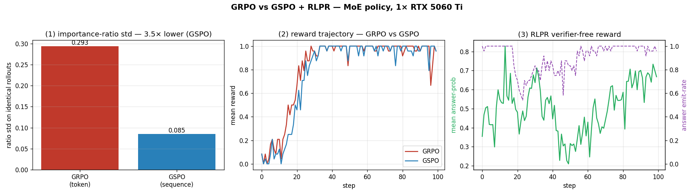

# GRPO vs GSPO + RLPR — measured on one GPU

**What:** a hardware measurement of the two §14 RL harvests against the shipped
GRPO learner (`platform/rl/grpo.py`, `platform/rl/verifiers.py`), on a small
**MoE** policy (GSPO's actual target regime) and a dense one. Driven by
`tools/bench_grpo_gspo.py` — a *measurement*, not a new code path; it exercises
`grpo_step` / `ProbabilityRewardVerifier` unchanged.

**TL;DR:**

- **GSPO's sequence-level importance ratio is ~4× lower-variance** than GRPO's
  token-level ratio on the *same* rollouts (std **0.077 vs 0.296** dense; **0.085
  vs 0.293** MoE). That low variance is the entire point — it's what keeps
  MoE-RL stable where token-level ratios jump as routing shifts.
- **On the MoE model, GSPO also reaches higher reward** (+0.944 vs GRPO's +0.875
  over 100 steps); on the dense model they tie (+0.986). Consistent with the
  paper: the sequence ratio matters *most* for MoE.
- **RLPR (verifier-free reward) works** — with a brief SFT warm-start + a KL
  anchor, the policy's own mean decoding probability of the reference answer
  climbs **0.44 → 0.70 (+0.26)** while the answer emit-rate holds ~0.98. No
  executable checker anywhere; the reward is just a forward pass.
- **One real bug fixed on the way:** `ProbabilityRewardVerifier` built its input
  tensor on CPU, so RLPR crashed on a GPU model — now placed on the model's
  device (`platform/rl/verifiers.py`).

Runs in ~13–23 s on one RTX 5060 Ti. CPU-runnable too (slower).



*Left: GSPO's sequence-level ratio has ~4× lower std than GRPO's token-level
ratio on identical rollouts. Middle: both objectives drive reward up, GSPO ahead
on the MoE policy. Right: RLPR's verifier-free reward (answer-probability) climbs
while the answer emit-rate stays high. Generated by `scripts/plot_grpo_gspo.py`.*

---

## (1) Importance-ratio variance — the GSPO claim, measured

On identical rollouts from a policy nudged a few % off its reference, we form
both ratios and measure their dispersion (averaged over 5 seeds):

| Policy | GRPO token-ratio std | GSPO seq-ratio std | variance reduction |
|--------|---------------------:|-------------------:|-------------------:|
| dense  | 0.296 | **0.077** | **3.9×** |
| MoE    | 0.293 | **0.085** | **3.5×** |

GSPO replaces GRPO's *per-token* ratio `exp(logπ_t − logπ_old_t)` with one
**length-normalized per-sequence** ratio. Averaging the log-ratio over the
sequence before exponentiating is what crushes the variance — a single noisy
token (or a routing flip in an MoE layer) no longer produces an outlier ratio
that the clip then has to absorb. This is exactly the instability GSPO was
designed to remove, and the ~4× number is a direct in-repo measurement of it.

## (2) Training stability — GRPO vs GSPO

Two otherwise-identical GRPO runs (same rollouts, reward, seeds), differing only
in `importance_sampling_level`, on a learnable verifier task (reward = response
contains a target token), 100 steps:

| Policy | GRPO reward Δ | GSPO reward Δ | note |
|--------|--------------:|--------------:|------|
| dense  | +0.986 | +0.986 | tie — both learn the task cleanly |
| **MoE** | +0.875 | **+0.944** | **GSPO ahead** — its target regime |

On the dense model both objectives drive the reward to ceiling. On the **MoE**
model — where token-level ratios are noisiest — **GSPO reaches a higher reward**,
the practical payoff of the variance reduction in (1). (GSPO's mean clip-fraction
is higher only because its clip is set proportionally tighter, by design; the
reward trajectory is what matters.)

## (3) RLPR — verifier-free reward, measured

RLPR replaces the rule-based verifier with the policy's **own mean decoding
probability of the reference answer** — a dense reward computable with *only the
model*, no sandbox. It's an after-SFT technique, so the harness SFT-warm-starts
the policy (so the answer is reachable) then runs RL with the RLPR reward + a KL
anchor to the warm policy:

| stage | mean answer-prob | answer emit-rate |
|-------|-----------------:|-----------------:|
| after SFT warm-start (RL step 0) | 0.44 | 0.99 |
| after 100 RLPR steps | **0.70** | 0.97 |

**The verifier-free reward sharpens the policy** (+0.26 answer-probability) with
no executable checker. Two lessons fell out, both standard-RLVR, both real:

- **RLPR needs a non-degenerate start.** A cold random-init policy never emits
  the target, so the group-relative advantage has no variance and the reward
  can't move (we saw it drift to ~0). RLPR is an *after-SFT* method — warm-start
  first.
- **`beta=0` collapses it.** Without a KL anchor the verifier-free reward is easy
  to hack: the policy drifts off the SFT solution and answer-prob collapses
  (0.24 → 0.0001 in an early run). A small KL-to-reference (`beta=0.1`) keeps it
  near the reachable answer while RLPR sharpens it — the standard recipe, and
  exactly why the GRPO learner ships a KL term + the MAI `EntropyController`.

---

## Reproduce

```bash
# dense + MoE, 100 steps, 5 seeds for the variance measure (~13–23 s each on a 5060 Ti)
python tools/bench_grpo_gspo.py --device cuda --steps 100 --group-size 12 --seeds 5 \
    --json-out out/grpo_gspo_dense.json
python tools/bench_grpo_gspo.py --device cuda --steps 100 --group-size 12 --seeds 5 --moe \
    --json-out out/grpo_gspo_moe.json
python scripts/plot_grpo_gspo.py out/grpo_gspo_moe.json   # -> examples/grpo_gspo_rlpr.png
```

The GSPO sequence ratio (`_sequence_importance_ratio`), the
`importance_sampling_level` switch, and the RLPR `ProbabilityRewardVerifier` are
all unit-tested in `tests/test_rl.py`; this harness is the hardware confirmation
that they behave as the papers describe.

**Caveat (scale).** A ~1 M-param toy policy on a 1-token-answer task: it
establishes the *mechanisms and their preconditions* (variance reduction,
MoE-stability edge, verifier-free reward sharpening, the warm-start + KL
requirements), not frontier numbers. The frontier payoff — GSPO stabilizing a
real MoE-RL run, RLPR extending RLVR to general-domain chat — is the ideal-tier
follow-up these mechanisms are the minimal-tier proof of.
