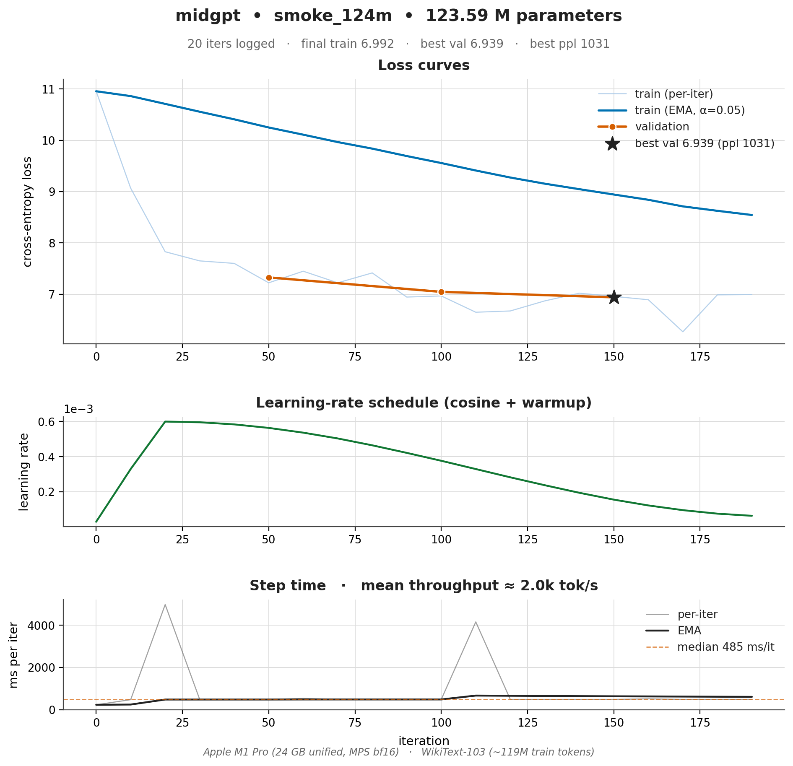

# midgpt — Mid-scale single-node GPT-2 trainer

GPT-2 scale (124M–1.5B). Real BPE tokenizer (`tiktoken`), WikiText-103 or OpenWebText, mixed precision, gradient checkpointing, gradient accumulation, cosine LR, DDP across 1–8 GPUs on a single node.

## What's different from `nanogpt-edu`

| Feature                       | nanogpt-edu | midgpt |
|-------------------------------|:----------:|:------:|
| Tokenizer                     | char-level | tiktoken (GPT-2 BPE, 50257) |
| Dataset                       | TinyShakespeare | WikiText-103 / OpenWebText |
| Mixed precision               | autocast   | autocast + GradScaler |
| Gradient checkpointing        | —          | ✅ (per-block) |
| Gradient accumulation         | basic      | DDP-aware (no_sync) |
| Multi-GPU                     | —          | torchrun + DDP |
| Eval                          | held-out loss | loss + perplexity + HellaSwag (zero-shot) |
| FlashAttention                | SDPA picks it | SDPA picks it; checkpoint-friendly |
| Logging                       | print      | print + JSON lines + optional W&B |
| Resume                        | last ckpt  | last ckpt with full RNG/optim/loader state |
| Optimizer                     | AdamW / Muon | AdamW / Muon (orthogonalized 2D-weight updates) |
| QK-Norm stabilizer            | ✅ opt-in   | ✅ opt-in (`model.qk_norm`) |
| Fused linear-CE (Liger)       | —          | ✅ opt-in (`fused_ce`, GPU+Triton) |

## Quickstart

```bash
pip install -r requirements.txt

# 1. Tokenize a dataset (writes shards to data/<name>/)
python prepare.py --dataset wikitext103             # ~500 MB tokens, ~10 min
# or — stream a 1B-token slice of FineWeb-Edu (~2 GB on disk, ~9 min)
python prepare.py --dataset fineweb-edu --streaming --max-tokens 1000000000
# or — full OpenWebText (~9B tokens, hours)
python prepare.py --dataset openwebtext --num-proc 16

# 2. Train (single GPU)
python train.py --config configs/gpt2_124m.yaml

# 3. Train (8 GPUs on one node)
torchrun --standalone --nproc_per_node 8 train.py --config configs/gpt2_350m.yaml

# 4. Evaluate
python eval.py --ckpt out/gpt2_124m/ckpt.pt --tasks ppl,hellaswag

# 5. Generate
python sample.py --ckpt out/gpt2_124m/ckpt.pt --prompt "Once upon a time"
```

## Configs

| File                          | Params | Layers | d_model | Tokens trained | GPU         | Wall  | Best val ppl |
|-------------------------------|-------:|-------:|--------:|---------------:|-------------|------:|-------------:|
| `smoke_124m.yaml`             | 124M   | 12     | 768     | ~0.2M (smoke)  | M1 Pro MPS  | 1.5 min | 1031        |
| **`gpt2_350m_fweb_5060ti.yaml`** | **354M** | **24** | **1024** | **131M**       | **RTX 5060 Ti 16 GB** | **2 h 27 min** | **58.2** |
| `gpt2_124m.yaml`              | 124M   | 12     | 768     | 10B (target)   | 1×H100      | ~30 h | —            |
| `gpt2_350m.yaml`              | 350M   | 24     | 1024    | 20B (target)   | 8×H100      | ~16 h | —            |
| `gpt2_774m.yaml`              | 774M   | 36     | 1280    | 40B (target)   | 8×H100      | ~4 d  | —            |
| `gpt2_1558m.yaml`             | 1.5B   | 48     | 1600    | 60B (target)   | 8×H100      | ~10 d | —            |

The 5060 Ti row is a *real measured run* (see
[`examples/5060ti_350m_fineweb.md`](examples/5060ti_350m_fineweb.md));
the others are napkin estimates at ~50 % MFU.

## Speed/quality knobs (opt-in, default-off for GPT-2 parity)

Ported from the modded-nanogpt / Liger work harvested in
[`../docs/2026-05-sota-llm-agi.md`](../docs/2026-05-sota-llm-agi.md). All are
config-gated and off by default so existing runs are bit-for-bit unchanged.

- **Muon optimizer** — set `optim.optimizer: muon`. Replaces the Adam update for
  2D *hidden* weight matrices (attn qkv/proj, MLP) with the nearest
  semi-orthogonal matrix via a 5-step Newton-Schulz iteration; embeddings,
  the learned position table, `lm_head`, and all 1-D params stay on AdamW.
  ~1.35× sample-efficiency on the FineWeb GPT-2 task. Tune with `optim.muon_lr`
  (default 0.02, higher than AdamW's) and `optim.muon_momentum`. A single cosine
  schedule scales both optimizers by the same multiplier. See `muon.py`.
- **Liger fused linear-cross-entropy** — set `fused_ce: true` (needs
  `pip install liger-kernel` + a Triton GPU). Computes the `lm_head` matmul and
  the cross-entropy in one kernel *without* materializing the `[B·T, vocab]`
  logits — the largest forward activation. Exact (not an approximation),
  ~20% faster / up to ~60% less memory. Loss-only on the train path; `eval.py`
  / sampling use the standard logits path.

```bash
# Muon + fused-CE on a single GPU
python train.py --config configs/gpt2_124m.yaml   # edit: optimizer: muon, fused_ce: true
```


## Worked example: 350M GPT-2 on FineWeb-Edu, 2.5 h on RTX 5060 Ti

A full pretraining run from random init, with a clean loss curve and
real sample completions:
[`examples/5060ti_350m_fineweb.md`](examples/5060ti_350m_fineweb.md).

| | |
|---|---|
| Model         | GPT-2 354M (24L × 1024d × 16H) |
| Dataset       | FineWeb-Edu `sample-10BT`, 1 B-token slice (streamed) |
| Wall-clock    | **2 h 27 min** (4 000 iters, 32 768 tok/step) |
| Throughput    | **14.9 k tok/s** sustained, 99 % GPU util |
| Peak VRAM     | **12.8 GB** / 16 GB |
| Best val      | **ppl 58.2** (loss 4.064) |


Textbook loss shape: fast drop in the first ~400 iters as the model
learns the vocab + bigrams, then a long slow descent to ~4.0 as it
actually starts modelling text. Val tracks train to within 0.05 — the
model is undertrained-by-design (0.37× Chinchilla), not overfit.

## Layout

```
midgpt/
├── model.py          # GPT-2 architecture (LayerNorm, learned posn, full attention)
├── muon.py           # Muon optimizer (Newton-Schulz) + 2D-weight param split
├── data.py           # tiktoken loader, packed sequences, mmap shards
├── prepare.py        # download + tokenize WikiText / OpenWebText
├── train.py          # DDP loop, AMP, grad-ckpt, grad-accum, resume
├── eval.py           # ppl + HellaSwag zero-shot harness
├── sample.py         # generation
├── utils/            # logging, schedule, ckpt manager
├── configs/          # YAML per model size
└── tests/
```

## Apple Silicon (MPS) support

`train.py` auto-detects MPS (Metal Performance Shaders) on macOS and runs in
native bf16 with `GradScaler` disabled (Metal doesn't need it for bf16). Tested
on an Apple M1 Pro (24 GB unified, macOS 26.3.1, PyTorch 2.12) — the 124M
config fits at micro-batch 4, sequence length 1024 with grad checkpointing.

A 200-iter smoke run on WikiText-103:



|              |              |
|--------------|--------------|
| device       | MPS bf16     |
| iters        | 200          |
| wall-clock   | ~1.5 min     |
| step time    | ~485 ms/it (median) |
| throughput   | ~2.1k tok/s  |
| train loss   | 10.96 → 6.99 |
| best val ppl | 1031         |

> ⚠️ Caveat — running a heavier 500-iter config (micro_batch=4, grad_accum=16,
> block_size=512 → 32× more compute per iter than the smoke run) triggered
> what looked like an MPS Metal-driver stall after ~30 iters: the process
> stayed alive but stopped advancing (`STAT=U`, ~8% CPU, 25 s of CPU time
> across 25 min wall-clock). The smoke config above completes cleanly — if
> you hit the same hang, reduce `micro_batch`/`grad_accum` and/or
> `block_size`, or set `grad_checkpoint: false`.

## What's still omitted (see `distributed-trainer`)

FSDP / tensor parallelism / pipeline parallelism / multi-node orchestration / RLHF.
