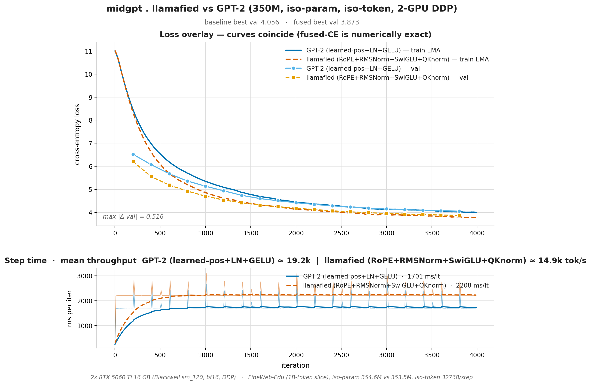

# 5060 Ti A/B — does the Llama recipe beat GPT-2 at 350 M / 131 M tokens?

A controlled, **iso-parameter / iso-token** architecture A/B at 350 M scale on
FineWeb-Edu, both arms trained from random init through midgpt's single-file
GPT on **2× RTX 5060 Ti 16 GB** (Blackwell, sm_120, native bf16, single-node
DDP). Only the architecture differs:

| Arm | Pos enc | Norm | MLP | QK-norm | d_ffn | Config |
|-----|---------|------|-----|:-------:|------:|--------|
| **A** — GPT-2 baseline | learned table | LayerNorm | GELU | ✗ | 4096 | [`gpt2_350m_fweb_5060ti_2gpu.yaml`](../configs/gpt2_350m_fweb_5060ti_2gpu.yaml) |
| **B** — llamafied | RoPE (θ=10k) | RMSNorm | SwiGLU | ✓ | 2730 | [`gpt2_350m_llamafied_fweb_5060ti_2gpu.yaml`](../configs/gpt2_350m_llamafied_fweb_5060ti_2gpu.yaml) |

Everything else is held fixed: same 1 B-token FineWeb-Edu slice, same tiktoken
`gpt2` BPE, same 24 L × 1024 d × 16 H shape, same tied embeddings, same
AdamW + cosine schedule (lr 3e-4 → 3e-5, 200-step warmup), same 4 000-iter
budget, same **32 768 tokens/step** (→ 131 M tokens), same seed, **same 2-GPU
DDP harness**. The d_ffn is dropped from 4096 (GELU, 2 matmuls) to 2730
≈ 8⁄3·d_model (SwiGLU, 3 matmuls) so the two MLPs are iso-param.

## TL;DR — the Llama recipe wins, cleanly and at every checkpoint

> **Arm B (llamafied) reaches val ppl 48.1 vs Arm A (GPT-2) 57.8 — a 16.8 %
> lower perplexity at identical parameter count and identical token budget.**
> It is ahead at *every one of the 19 evals*, by as much as 40 % early in
> training, settling to a steady ~17 % once both converge. Same loop, same
> data, same compute — the architecture is the only variable, and the Llama
> recipe is unambiguously better here.

```bash
cd midgpt
# both arms, sequentially, on 2 GPUs (~4.4 h total) — one command:
bash tools/run_llamafied_AB.sh
# → trains Arm A, then Arm B, then renders the comparison plot + prints ALL DONE
```

## Headline numbers

| Metric | **A — GPT-2** | **B — llamafied** | Δ |
|---|---:|---:|---:|
| Architecture | learned-pos · LN · GELU | RoPE · RMSNorm · SwiGLU · QK-norm | — |
| Params (non-emb iso) | **354.60 M** | **353.51 M** | 0.31 % apart |
| Tokens/step | 32 768 (4×4×2×1024) | 32 768 (2×8×2×1024) | iso-token |
| Tokens trained | 131 M | 131 M | iso |
| Best val loss | 4.0562 | **3.8728** | **−0.183 nats** |
| **Best val ppl** | **57.8** | **48.1** | **−16.8 %** |
| Best @ iter | 3 800 | 3 800 | same |
| Train loss (first→last) | 9.29 → 3.87 | 9.38 → 3.66 | — |
| Wall-clock | **1 h 56 min** | **2 h 29 min** | +33 min |
| Throughput | **19.3 k tok/s** | **14.8 k tok/s** | −23 % |
| Median ms/step | 1 701 | 2 208 | +30 % |
| Peak VRAM / GPU | ~11.9 GB | **~13.0 GB** | +1.1 GB |

Both arms hit their best val at **iter 3 800** — same schedule, same sweet
spot, just a different floor. The quality win (B) costs throughput and VRAM
(also B): RoPE's per-head rotation, SwiGLU's third matmul, and the QK-norm
both cost FLOPs *and* activation memory. **You pay ~23 % throughput and
~1 GB VRAM for a 17 % perplexity improvement.**

## Head-to-head: B leads at every single eval

The full eval trajectory (held-out FineWeb-Edu, 50 iters × 4 × 1024 ≈ 200 k
tokens per point). `Δnats` is A−B (positive = B better); `ppl↓%` is B's
perplexity reduction vs A:

| iter | A loss | A ppl | B loss | B ppl | Δnats | ppl↓% |
|-----:|-------:|------:|-------:|------:|------:|------:|
|  200 | 6.521 | 679.1 | 6.206 | 495.5 | +0.315 | 27.0 % |
|  400 | 6.071 | 433.1 | 5.555 | 258.6 | +0.516 | **40.3 %** |
|  600 | 5.677 | 292.1 | 5.186 | 178.7 | +0.491 | 38.8 % |
|  800 | 5.362 | 213.2 | 4.924 | 137.6 | +0.438 | 35.5 % |
| 1000 | 5.138 | 170.3 | 4.705 | 110.5 | +0.432 | 35.1 % |
| 1200 | 4.938 | 139.5 | 4.539 | 93.6 | +0.399 | 32.9 % |
| 1400 | 4.743 | 114.7 | 4.419 | 83.0 | +0.324 | 27.7 % |
| 1600 | 4.602 | 99.7 | 4.322 | 75.4 | +0.280 | 24.4 % |
| 1800 | 4.506 | 90.6 | 4.249 | 70.0 | +0.257 | 22.7 % |
| 2000 | 4.422 | 83.2 | 4.180 | 65.4 | +0.241 | 21.4 % |
| 2200 | 4.346 | 77.2 | 4.124 | 61.8 | +0.222 | 19.9 % |
| 2400 | 4.286 | 72.7 | 4.071 | 58.6 | +0.215 | 19.4 % |
| 2600 | 4.234 | 69.0 | 4.025 | 56.0 | +0.209 | 18.9 % |
| 2800 | 4.188 | 65.9 | 3.988 | 53.9 | +0.200 | 18.2 % |
| 3000 | 4.153 | 63.6 | 3.955 | 52.2 | +0.197 | 17.9 % |
| 3200 | 4.119 | 61.5 | 3.926 | 50.7 | +0.193 | 17.6 % |
| 3400 | 4.095 | 60.0 | 3.905 | 49.7 | +0.190 | 17.3 % |
| 3600 | 4.072 | 58.6 | 3.887 | 48.8 | +0.184 | 16.8 % |
| **3800** | **4.056** | **57.8** | **3.873** | **48.1** | **+0.183** | **16.8 %** |

Two things stand out. First, **the advantage is largest early** — at iter 400
the llamafied model already has 40 % lower perplexity, because RoPE +
RMSNorm + SwiGLU let it learn the vocabulary and frequent bigrams faster.
Second, **the gap never closes**: it narrows from 40 % to a stable ~17 % as
both models saturate the 131 M-token budget, but B is strictly ahead at every
checkpoint. There is no iteration at which choosing GPT-2 would have been
correct.

Notably, **B passes A's *best-ever* val (4.056) by iter ~2 400** — i.e. the
llamafied model reaches the GPT-2 model's final quality with ~37 % fewer
tokens, then keeps improving for another 1 400 iters.



## Sample completions (same prompt + seed, both best checkpoints)

Greedy-ish sampling (`temperature 0.8`, `top_k 200`), identical seed per pair.
Neither model is good — 131 M tokens is ~0.37× Chinchilla for 350 M, both are
deeply undertrained — but the **relative** coherence tracks the perplexity gap.

**Prompt:** *"The history of science shows that"* (seed 1337)

> **A — GPT-2 (ppl 57.8):** …the time of the science was over, we were finally
> so far as exciting that we are in general. The second day after the discovery
> of the Internet, however, the first day of the discovery was that the first
> few years of the discovery of the Internet was made in the history of the
> Internet. The discovery of the internet, however, proves to be the only time
> the scientists have been actually trying to reconstruct the internet…

> **B — llamafied (ppl 48.1):** …the early works of science are often in the
> hands of the scientific community, with no real reason to look at the
> scientific answers to the problem. Science has always been a problem, and has
> always been a problem. The problem of the very nature of science is not merely
> in the ways of science but of the past…

The GPT-2 sample collapses into an "Internet" loop within two sentences; the
llamafied sample holds the "science as a problem" theme across the whole
passage. Both repeat (expected at this scale), but B's repetition is *on
topic*.

**Prompt:** *"To make a good cup of coffee, you"* (seed 42)

> **A — GPT-2:** …can make several times a week for a week to have a hard time
> making it hard for you… You can use a high-calorie baking soda to make it fun
> for you…

> **B — llamafied:** …must sit down and watch as much as you can. When you
> drink coffee, you can relax your muscles and help you relax. Another way to
> eat coffee is not to consume a lot of it…

Both are semantically loose, but B keeps "coffee → relax / consume" associations
coherent where A drifts into "baking soda" non-sequiturs.

## The systems story: SwiGLU + QK-norm cost more activation memory

This A/B wasn't free to run — Arm B **OOM'd twice** before training cleanly,
and the fix is a genuinely citable finding about the Llama recipe's *memory*
profile (not just its quality).

The naive iso-token 2-GPU config mirrored Arm A exactly: `micro_batch 4`,
`grad_accum 4`, `world 2` → 32 768 tok/step. Arm A runs that comfortably at
~11.9 GB/GPU. **Arm B OOM'd in the forward pass** at `F.cross_entropy`
(`model.py:385`) with 14.46 GiB allocated — even after
`PYTORCH_CUDA_ALLOC_CONF=expandable_segments:True` reclaimed fragmentation.

Why does the *same parameter count* need more memory? Because iso-param is not
iso-activation:

- **SwiGLU keeps three FFN activations resident** (`w1 x`, `w3 x`, and their
  SiLU-gated product) where GELU keeps one. Even at the reduced d_ffn=2730,
  the gated path stores more intermediate activation than GELU at d_ffn=4096.
- **QK-norm** adds two RMSNorm activations per attention block (on Q and K)
  that the GPT-2 arm simply doesn't have.
- The **fp32 cross-entropy logits transient** — `(micro_batch · seq) × vocab ×
  4 B` — is the single biggest spike. At micro_batch=4 that's
  `4 · 1024 · 50304 · 4 B ≈ 824 MiB` materialized at once, on top of the
  already-higher llamafied activation base.

**The fix preserves the iso-token contract exactly while halving the activation
footprint:** `micro_batch 4 → 2`, `grad_accum 4 → 8`. Then
`2 × 8 × 2 × 1024 = 32 768` tok/step — *mathematically identical* optimization
(same global batch, same gradient, same 131 M tokens, same LR schedule), but
the cross-entropy transient halves to ~412 MiB and every activation tensor is
half as tall. Arm B then ran flat at **~13.0 GB/GPU** with ~1.4 GB headroom,
surviving the iter-200 eval memory spike.

The cost is throughput: micro_batch=2 means smaller GEMMs and less
arithmetic-intensity, which (together with the llamafied arch overhead) is why
B runs at 14.8 k tok/s vs A's 19.3 k. **The lesson: at the memory edge, the
Llama recipe buys quality partly with activation memory, and on a 16 GB card
you pay that back in micro-batch size → throughput.** On an A100/H100 the
headroom makes this a non-issue; on a 5060 Ti it's a real tradeoff.

## Verdict

**At 350 M parameters and 131 M training tokens on FineWeb-Edu, the Llama
recipe (RoPE + RMSNorm + SwiGLU + QK-norm) decisively beats the GPT-2 recipe
(learned-pos + LayerNorm + GELU) at equal parameter count and equal token
budget — 48.1 vs 57.8 val perplexity, a 16.8 % improvement, winning at every
one of 19 evals and reaching GPT-2's final quality ~37 % sooner.**

The win is real but bounded: it's an *architecture* win, not a free lunch.
You pay ~23 % throughput and ~1 GB VRAM (forcing a smaller micro-batch on a
16 GB card) for the perplexity gain. At this scale and on this hardware that
trade is clearly worth it. The result also lands consistently with
[`distgpt`'s 416 M Llama-arch run](../../distgpt/examples/5060ti_416m_fineweb.md)
(val ppl 60.7 at 98 M tokens / 0.24× Chinchilla) — the two Llama-arch models
sit on the same FineWeb-Edu scaling curve, reached through two completely
different codebases.

## Reproduce

```bash
cd midgpt
.venv/bin/pip install -r requirements.txt          # one-time
ln -s ../midgpt/data/fineweb-edu data/fineweb-edu  # if not already present

# One command: both arms (sequential) + comparison plot
bash tools/run_llamafied_AB.sh

# …or each arm by hand (both via torchrun on 2 GPUs):
.venv/bin/torchrun --standalone --nproc_per_node 2 train.py \
    --config configs/gpt2_350m_fweb_5060ti_2gpu.yaml          # Arm A
.venv/bin/torchrun --standalone --nproc_per_node 2 train.py \
    --config configs/gpt2_350m_llamafied_fweb_5060ti_2gpu.yaml # Arm B

# Comparison plot (llamafied run vs GPT-2 baseline):
.venv/bin/python tools/plot_midgpt_compare.py \
    --run  out/gpt2_350m_llamafied_fweb_5060ti_2gpu/log.jsonl "llamafied (RoPE+RMSNorm+SwiGLU+QKnorm)" \
    --base out/gpt2_350m_fweb_5060ti_2gpu/log.jsonl "GPT-2 (learned-pos+LN+GELU)" \
    --out  out/gpt2_350m_llamafied_fweb_5060ti_2gpu/compare_llamafied.png \
    --hardware "2× RTX 5060 Ti 16 GB (Blackwell sm_120, bf16, DDP)" \
    --dataset  "FineWeb-Edu (1B-token slice), iso-param 354.6M vs 353.5M, iso-token 32768/step" \
    --title    "midgpt · llamafied vs GPT-2 (350M, iso-param, iso-token)"

# Sample from either checkpoint:
.venv/bin/python sample.py --ckpt out/gpt2_350m_llamafied_fweb_5060ti_2gpu/ckpt_best.pt \
    --prompt "The history of science shows that" --max-new-tokens 120 --seed 1337
```

## Files

| Thing | Path |
|---|---|
| Arm A config (2-GPU iso-token) | [`configs/gpt2_350m_fweb_5060ti_2gpu.yaml`](../configs/gpt2_350m_fweb_5060ti_2gpu.yaml) |
| Arm B config (2-GPU iso-token, mb=2) | [`configs/gpt2_350m_llamafied_fweb_5060ti_2gpu.yaml`](../configs/gpt2_350m_llamafied_fweb_5060ti_2gpu.yaml) |
| Arm A log / best ckpt | `out/gpt2_350m_fweb_5060ti_2gpu/{log.jsonl,ckpt_best.pt}` |
| Arm B log / best ckpt | `out/gpt2_350m_llamafied_fweb_5060ti_2gpu/{log.jsonl,ckpt_best.pt}` |
| Comparison plot | [`out/gpt2_350m_llamafied_fweb_5060ti_2gpu/compare_llamafied.png`](../out/gpt2_350m_llamafied_fweb_5060ti_2gpu/compare_llamafied.png) |
| A/B orchestrator | [`tools/run_llamafied_AB.sh`](../tools/run_llamafied_AB.sh) |
| Plot script | [`../tools/plot_midgpt_compare.py`](../tools/plot_midgpt_compare.py) |
| Single-GPU GPT-2 companion run | [`examples/5060ti_350m_fineweb.md`](5060ti_350m_fineweb.md) |
| distgpt 416M Llama-arch companion | [`../../distgpt/examples/5060ti_416m_fineweb.md`](../../distgpt/examples/5060ti_416m_fineweb.md) |
