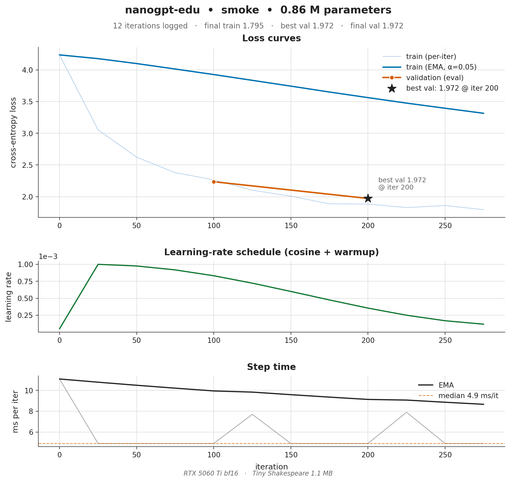
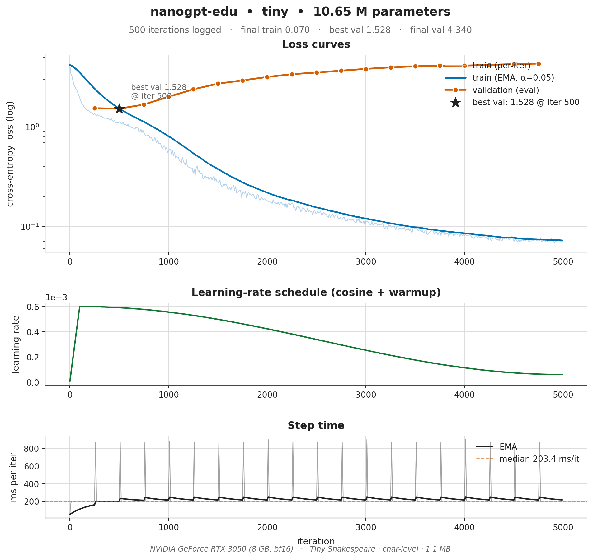
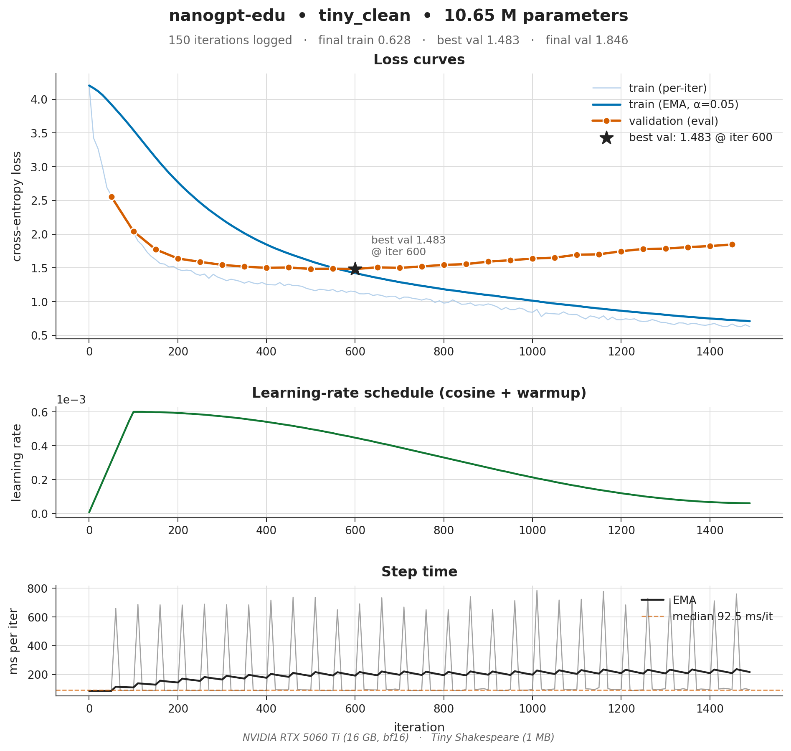
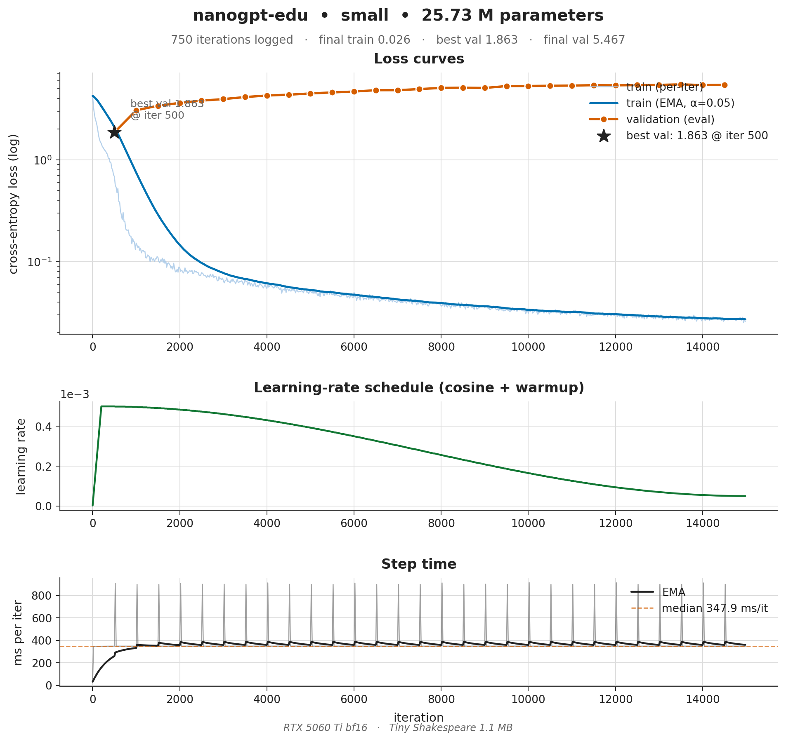
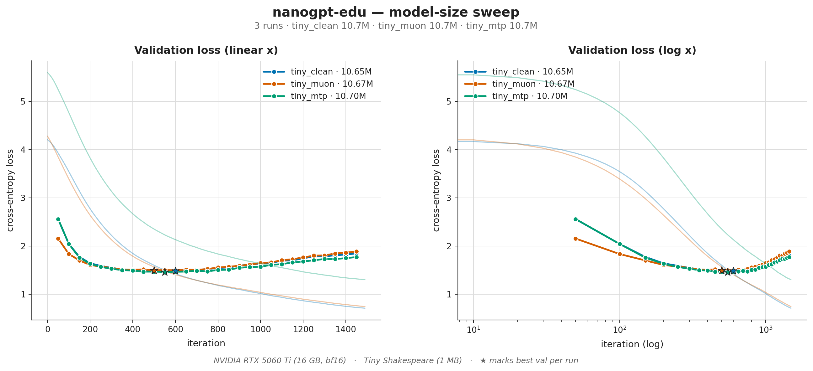

# nanogpt-edu — Educational GPT trainer

~500 lines of PyTorch. Trains a 10M–100M parameter GPT on TinyShakespeare on a single GPU or CPU. Inspired by Karpathy's nanoGPT, restructured for readability.

## What you get

- `model.py` — decoder-only transformer (RoPE, RMSNorm, SwiGLU, GQA optional). One file, ~180 lines.
- `data.py` — character-level dataset + binary-shard dataset.
- `train.py` — training loop with cosine LR, grad clipping, AMP, eval, checkpoints.
- `sample.py` — generate text from a checkpoint.
- `prepare_shakespeare.py` — download + tokenize TinyShakespeare.

## Quickstart

```bash
pip install torch numpy requests
python prepare_shakespeare.py            # ~1 MB download
python train.py --config configs/tiny.py # ~10M params, ~5 min on 1 GPU, ~1h on CPU
python sample.py --ckpt out/ckpt.pt --prompt "ROMEO:"
```

## Configs

| Config        | Params | Layers | d_model | Train time (1× RTX 4090) |
|---------------|-------:|-------:|--------:|--------------------------:|
| `tiny.py`     | ~10M   | 6      | 384     | ~5 min                    |
| `small.py`    | ~30M   | 8      | 512     | ~20 min                   |
| `medium.py`   | ~110M  | 12     | 768     | ~2 h                      |

## Actual training results (1× RTX 3050, 8 GB)

Char-level Tiny Shakespeare (1 MB). Training stdout logs are committed
under `out/<run>/train.log`; PNG/SVG plots are written by
`python tools/plot_nanogpt.py out/<run>/train.log`.

| Run         | Params  | Iters done   | ms/it (3050) | Wall    | Final train | **Best val** | Final val | Overfit Δ |
|-------------|--------:|-------------:|-------------:|--------:|------------:|-------------:|----------:|----------:|
| `smoke`     |  0.86 M | 275 / 300    |  14.0        |  ~5 s   | 1.90        | **1.99**     | 1.99      |  ~0       |
| `tiny`      | 10.65 M | 4,990 / 5,000|  203.4       | ~17 min | 0.07        | **1.53**     | 4.34      | **2.81**  |
| `tiny_clean`| 10.65 M | 1,500 / 1,500|  92.5 \*     | ~2.3 min \*| 0.53      | **1.48**     | 1.85      |   0.36    |
| `small`     | 25.73 M | 9,600 / 15,000 (killed @ 64 %) |  798.4 | ~2 h 15 | 0.04        | **1.87**     | 5.21      |   3.35    |

> \* **`tiny_clean` timings are from an RTX 5060 Ti, not the 3050.** When the
> rig was upgraded, `tiny_clean` was the one row re-run on the new card (its
> committed `out/tiny_clean/train.log` is the 5060 Ti log: ~92.5 ms/it median,
> ~2.3 min wall). `smoke`/`tiny`/`small` above are the original 3050 logs and
> are unchanged. The **loss** columns are hardware-independent and directly
> comparable across all four rows; only `tiny_clean`'s ms/it + wall reflect the
> faster GPU. The full migration of the remaining rows is tracked separately.

`tiny_clean` is the same architecture as `tiny`, run for 1,500 iterations
with `dropout=0.1` instead of `0.0`. It's the **regularized** counterpart
that produces the textbook U-shaped val curve (descent → minimum → mild
ascent) — and notably, it lands on a *slightly better* best-val (1.48 vs
1.53) than the un-regularized `tiny` did, while overfitting **8× less**.

Things the plots make obvious:

1. **Step time scales roughly with `d_model²·block_size`** on the 3050:
   14 → 203 → 798 ms (d_model 128 → 384 → 512, block 128 → 256 → 512).
2. **Tiny Shakespeare overfits hard on any non-trivial model.** Both
   `tiny` and `small` hit their best val between iter ~500–800 (right
   after warmup), then val rises monotonically while train collapses
   toward zero. **The useful checkpoint is *not* the last one.**
3. **Bigger model is worse on val** at this dataset scale (best val 1.87
   for `small` vs 1.53 for `tiny`) — classic overcapacity for a 1 MB
   corpus. To make the larger config actually shine, scale tokens with
   params (i.e. use a larger dataset) or add dropout/early stopping.
4. **Cosine schedule looks textbook** in panel 2 — short warmup, smooth
   decay to `min_lr`.

### Per-run plots

Each PNG is 3-panel: train+val loss / cosine LR / step time.

| smoke | tiny | tiny_clean | small |
|---|---|---|---|
|  |  |  |  |

### Cross-run comparison

Linear-x and log-x val-loss overlays for all three "real" runs (`tiny`,
`tiny_clean`, `small`):


### Overfit vs regularized — same architecture, two outcomes

`tiny` (no dropout, 5,000 iters) vs `tiny_clean` (dropout 0.1, 1,500 iters).
Both are 10.65 M params on the same 1 MB of Shakespeare. The *only*
intervention is dropout + early stopping; you can read the textbook
overfit picture directly off the val curves:


### Reproducing

```bash
mkdir -p out/{smoke,tiny,tiny_clean,small}
python train.py --config configs/smoke.py      2>&1 | tee out/smoke/train.log
python train.py --config configs/tiny.py       2>&1 | tee out/tiny/train.log
python train.py --config configs/tiny_clean.py 2>&1 | tee out/tiny_clean/train.log
python train.py --config configs/small.py      2>&1 | tee out/small/train.log

# Plot one run, all + a comparison overlay, or the overfit-vs-regularized panel:
python tools/plot_nanogpt.py out/tiny/train.log
python tools/plot_nanogpt.py out/{smoke,tiny,tiny_clean,small}/train.log \
    --compare out/compare.png \
    --hardware "RTX 3050 bf16" --dataset "Tiny Shakespeare 1.1 MB"
python tools/plot_nanogpt.py out/{tiny,tiny_clean}/train.log \
    --compare out/compare_overfit.png
```

`tools/plot_nanogpt.py` uses matplotlib for PNGs if available and always
writes a zero-dependency SVG fallback.

## Going faster — the modded-nanogpt speedrun knobs

The base configs are deliberately vanilla. Several techniques from Keller
Jordan's [modded-nanogpt speedrun](https://github.com/KellerJordan/modded-nanogpt)
(which trains GPT-2 to the llm.c target ~15× faster) are now available as
opt-in config flags — small, readable, and pedagogically interesting:

| Knob | Config key | What it does |
|------|-----------|--------------|
| **Muon optimizer** | `optimizer='muon'` (+`muon_lr`) | Orthogonalizes the SGD-momentum update for 2D hidden weights via a 5-step Newton-Schulz iteration; embeddings/lm_head/norms stay on AdamW. ~1.35× sample-efficiency on FineWeb. See `muon.py`. |
| **QK-Norm** | `qk_norm=True` | Per-head RMSNorm on Q and K before RoPE — stabilizes attention logits, lets you push LR higher. |
| **Zero-init projections** | `zero_init_proj=True` | Zero-inits the residual-write matrices (attn `o_proj`, ffn `w2`) so each block starts as identity — stable high-LR warmup (muP-like). |
| **Untied embeddings** | `tie_embeddings=False` | Gives `lm_head` its own weight; helps loss once you have the tokens to support the extra params. |
| **Multi-Token Prediction** | `mtp_tokens=2` (+`mtp_weight`) | Auxiliary heads predict tokens n+2/n+3 alongside n+1 (DeepSeek-V3 style). Denser gradient → better sample efficiency in early training. *Train-only* — `generate()` uses the main head, so zero inference cost. |
| **FlexAttention backend** | `attention_backend='flex'` | Swaps SDPA for PyTorch FlexAttention (default stays `'sdpa'`). An opt-in path for custom-mask / long-context experiments; guarded (no dropout, CPU = inference/no-grad only) and rebuilds the causal block mask per call. See `model.py`. |

A ready-made head-to-head config is `configs/tiny_muon.py` — same 10.65M
architecture as `tiny_clean.py`, same iters/budget, all four knobs on:

```bash
python train.py --config configs/tiny_clean.py  # AdamW baseline
python train.py --config configs/tiny_muon.py   # Muon + speedrun knobs
python train.py --config configs/tiny_mtp.py    # Multi-Token Prediction
python tools/plot_nanogpt.py out/{tiny_clean,tiny_muon,tiny_mtp}/train.log \
    --compare out/compare_harvest.png \
    --hardware "RTX 5060 Ti bf16" --dataset "Tiny Shakespeare 1.1 MB"
```

`configs/tiny_mtp.py` isolates Multi-Token Prediction (on the AdamW baseline)
for a clean A/B against `tiny_clean.py`. The MTP aux loss is train-only, so the
logged **val** loss stays directly comparable between the two runs.

### Measured A/B — baseline vs Muon vs MTP (RTX 5060 Ti, bf16)

All three are the same 10.65M architecture, same 1,500 iters / cosine schedule /
seed, on the same 1 MB of TinyShakespeare. Only the harvested knob changes:

| Run | Harvest knob | **Best val** | vs baseline | ms/it |
|-----|--------------|-------------:|------------:|------:|
| `tiny_clean` | — (AdamW baseline) | 1.4831 | — | ~95 |
| `tiny_muon`  | Muon + QK-norm + zero-init + untied | 1.4934 | +0.010 | ~145 |
| `tiny_mtp`   | Multi-Token Prediction (mtp_tokens=2) | **1.4613** | **−0.022** | ~88 |



**Reading this honestly:** at this scale the **data is the bottleneck, not the
optimizer**, so Muon does *not* win here — it lands fractionally behind AdamW
(+0.010 val), exactly as `tiny_muon.py`'s own docstring predicts. Muon's
~1.35× sample-efficiency shows up when tokens scale with params; see the
FineWeb-Edu section (and `midgpt`'s 350M FineWeb run) for where it pays off.
**MTP**, by contrast, *does* help even here (−0.022 val) — its denser gradient
is most valuable precisely in the low-data/early-training regime these tiny runs
live in, at zero inference cost (the heads are discarded by `generate()`).

### MTP heads as a free speculative-decoding draft (serving benchmark)

The MTP heads are trained as a throwaway auxiliary loss — but at inference each
one predicts a *future* token from the same final hidden state, so they double
as a Medusa-style self-speculative **draft model for free**. `generate()` still
uses the main head only (zero-cost default); `tools/bench_mtp_spec.py` measures
what the heads buy when you *do* use them:

```bash
python train.py --config configs/tiny_mtp.py            # train a mtp_tokens=2 model
python tools/bench_mtp_spec.py --ckpt out/tiny_mtp/ckpt.pt --prompt $'ROMEO:\n' --tokens 256
```

One trunk pass drafts `K+1` candidate tokens (main head + K MTP drafts); a
second pass verifies them with the main head's greedy argmax, accepting the
longest matching prefix (plus a bonus token when the whole chain verifies). A
real run of a 10.7M `mtp_tokens=2` checkpoint on an RTX 3050:

| decoder | tokens/s | trunk passes (256 tokens) | speedup |
|---------|---------:|--------------------------:|--------:|
| baseline greedy | ~240 | 256 | 1.00× |
| MTP-speculative | ~355 | 170 | **1.48×** |

Output is **bit-identical** to greedy decoding (greedy verification is exact —
the tool asserts it), so the 1.48× is a pure latency win at zero quality cost:
~3.0 tokens emitted per verification round, 34% fewer trunk passes. The same
MTP head that densified the training gradient pays off again at serving time —
exactly the train→serve loop the SOTA watch flags. Runs anywhere (with no
`--ckpt` it builds a random tiny model to exercise the mechanism in CI).


> On 1 MB of TinyShakespeare the **data** is the bottleneck, not the optimizer,
> so the gap is modest. To see Muon shine, scale the tokens (next section).

## Scaling the data — FineWeb-Edu (fixes the overfit story)

The README results above show every non-trivial model overfitting 1 MB of
Shakespeare, with the *bigger* model doing *worse* on val. That's a data-scale
artifact, not a model flaw (Chinchilla: scale tokens with params). Swap in a
slice of [FineWeb-Edu](https://huggingface.co/datasets/HuggingFaceFW/fineweb-edu)
(GPT-2 BPE tokenized, same shard format) and the inversion disappears:

```bash
pip install tiktoken datasets
python prepare_fineweb.py --tokens 100_000_000 --out-dir data_fineweb
python train.py --config configs/small_fineweb.py   # Muon + real data
python sample.py --ckpt out/small_fineweb/ckpt_best.pt --prompt "The mitochondria"
```

`prepare_fineweb.py` streams the dataset and writes `train.bin`/`val.bin`/
`meta.pkl` exactly like `prepare_shakespeare.py`; `sample.py` auto-detects the
BPE tokenizer from `meta["tokenizer"]`. Pass `--dataset dclm` for the
DataComp-LM baseline (~10% better on MMLU at matched compute than FineWeb-Edu).

> **Token budget (Chinchilla and beyond).** The default examples sit *far*
> below compute-optimal: `tiny` trains a 10.65M model on ~1M tokens (~0.005×
> Chinchilla's ~20 tok/param). Modern small models deliberately *over-train* —
> Llama-3 / Qwen2.5 use 20–50× Chinchilla, i.e. hundreds of tokens per param.
> Scaling tokens with params is the single highest-ROI knob here: with the
> 100M-token FineWeb slice the `small`/`medium` configs stop overfitting and
> the bigger-is-better ordering is restored. Bump `--tokens` (and `max_iters`)
> before reaching for a fancier optimizer.

## What this teaches

1. How attention, RoPE, RMSNorm, SwiGLU, and the residual stream fit together.
2. The full training loop: data → forward → loss → backward → step → log → checkpoint.
3. Mixed precision (`torch.amp`) and gradient clipping.
4. Cosine LR schedule with warmup.
5. Sampling with temperature + top-k.

## What it deliberately omits

FSDP, MoE, RLHF — see the `mid-scale-trainer` and `distributed-trainer`
projects. FlashAttention is used implicitly via PyTorch SDPA (an opt-in
`attention_backend='flex'` FlexAttention path also exists for mask experiments).
Many of the modded-nanogpt speedrun's heavier tricks (FlexAttention long-short
windows, FP8 matmul, U-net skip connections, value embeddings) are also omitted
to keep the core legible — the cheapest/most-instructive ones (Muon, QK-norm,
zero-init, untied head, and DeepSeek-V3-style Multi-Token Prediction) are
available as opt-in flags; see above. FP8 in
particular needs Hopper+ and is useless on consumer Ampere/Blackwell cards.
