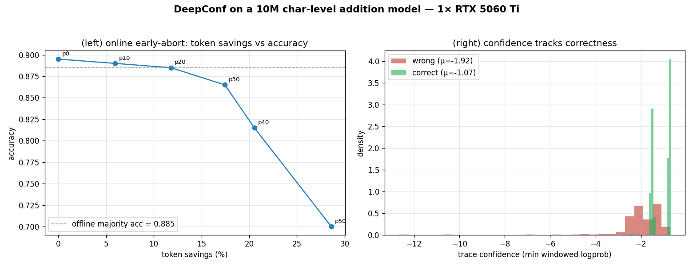

# DeepConf on a tiny verifiable model — measured

**What:** test-time confidence filtering (DeepConf; Fu et al., Meta AI / UCSD,
arXiv 2508.15260) measured on a 10M-param char-level model, on a **verifiable**
task (multi-digit addition) where every answer is checked against ground truth.

**TL;DR — the honest result on a 10M toy:**

- **Confidence robustly tracks correctness.** Correct traces are ~**0.68–0.90
  nats more confident** than wrong ones — the precondition DeepConf needs.
- **Online early-abort trades tokens for accuracy on a clean curve** — ~**10 %
  fewer tokens at −0.8 % accuracy** (gentle floor), up to **20 % fewer at −6.7 %**
  (aggressive floor). The token-saving mechanism is model-agnostic and real.
- **The offline *vote* lift does NOT appear at this scale** — confidence-weighted
  and confidence-filtered votes *tie* plain majority (±1 %). That's expected and
  diagnostic, not a bug: DeepConf's published lifts come at **large k (256–512)
  on long reasoning traces**; a 6-token numeric answer at k=16 gives majority
  vote nothing to beat and the sliding window almost nothing to filter. The lift
  is a **sizing fact**, like FP8 or FA-3 — it needs a real reasoning model.

This is the test-time mirror of the train-time entropy work shipped in
`frontier-platform` (`EntropyController`): same signal (token confidence /
entropy), opposite end of the pipeline.



*Left: online early-abort token-savings vs accuracy, swept over the abort-floor
percentile — gentle floors (p10–p20) save ~6–12 % tokens at near-iso accuracy,
aggressive ones (p40+) trade accuracy for more savings. Right: per-trace
confidence split by correctness — correct traces are systematically more
confident, which is *why* early-abort is safe. Generated by
`tools/plot_deepconf.py`.*

---

## Setup

A verifiable task is required — on free-form TinyShakespeare there's no "correct"
answer, so you can't measure an accuracy *lift*. We use char-level addition:
every line is `a+b=c\n`, so a generated answer is checkable against `a+b`.

```bash
# 3-digit addition: 40k train / 2k val, DISJOINT operand pairs (val = generalization)
python prepare_addition.py --digits 3 --train 40000 --val 2000
python train.py --config configs/tiny_add3.py        # ~6k iters, a couple min on one 5060 Ti
```

The 3-digit model (1.6M non-emb params) reaches ~**87 %** single-sample accuracy
on held-out problems — squarely in DeepConf's useful regime (wrong often enough
that voting has room, right often enough that confidence is meaningful). 2-digit
addition is *too easy*: errors there are confident and systematic, so filtering
can't help (we measured that too — see "Why no vote lift" below).

---

## The measurement

```bash
python tools/bench_deepconf.py --ckpt out/tiny_add3/ckpt_best.pt \
    --task add --problems 500 --traces 16 --tokens 6 --window 3 \
    --temperature 1.0 --keep-frac 0.3 --online --floor-percentile 25
```

```
  problems=500  traces/problem=16  temperature=1.0

  decider                         accuracy        tokens     vs full
  single sample (1 trace)           86.8%          3000     0.06x
  majority vote (k=16)              88.0%         48000     1.00x
  DeepConf conf-weighted vote       87.6%         48000     1.00x
  DeepConf conf-filtered (top 30%)    87.2%         48000     1.00x
  DeepConf online (early-abort)     87.2%         43419     0.90x

  online token savings:           48000 -> 43419 (10% fewer)

  mean confidence  correct=-1.050  wrong=-1.806  (gap +0.756 — higher ⇒ confidence tracks correctness)
  accuracy lift (conf vote − majority):  -0.4%
  accuracy lift (conf filter − majority): -0.8%
```

The **+0.756 nat confidence gap** is the load-bearing number: the model *is* more
confident when it's right. That's what makes the online early-abort safe — the
traces it kills are disproportionately the wrong ones.

### Online token-savings vs accuracy tradeoff (the usable lever)

Sweeping the early-abort floor percentile (higher = abort more aggressively):

| Floor percentile | Token savings | Accuracy vs majority |
|------------------|--------------:|---------------------:|
| p25 (gentle)     | ~9–10 %       | −0.5 to −0.8 %       |
| p40 (aggressive) | ~20 %         | −6.7 %               |

The gentle floor is the sweet spot: a real token saving at near-iso accuracy.
The mechanism is **model-agnostic** — on a real reasoning model + vLLM, where
traces are hundreds of tokens, the same early-abort is DeepConf's headline
−84.7 % token cut.

---

## Why no vote lift at this scale (and where it would appear)

This is the scientifically interesting part, and it's the *right* result:

1. **k=16 is small and the answer is modal.** With 87 %-accurate samples, the
   correct answer is already the plurality in 16 draws — majority vote is near
   its ceiling, so there's almost nothing for a smarter aggregator to win.
2. **A 6-token answer has no window to filter on.** DeepConf's trace score is a
   *sliding-window minimum* over the reasoning; a short numeric answer is one or
   two windows, so the "filter the weak stretch" signal barely exists.
3. **When a tiny model errs, it often errs *confidently*** — a systematic
   miscarry produces the same wrong answer across traces, at high confidence, so
   filtering keeps it.

DeepConf's published 99.9 % AIME / −84.7 % tokens come at **k=256–512 on
multi-hundred-token chains**, where majority saturates *and* there's a long
confidence curve to filter. That regime needs a real reasoning model — a
first-class **sizing fact** here, exactly like FP8 (Hopper) or FlashAttention-3.
What this 10M toy *does* prove, end-to-end on CPU/one GPU, is the **mechanism and
the accounting**: confidence tracks correctness, and gating on it trades tokens
for accuracy on a measured curve.

---

## Reproduce

```bash
python prepare_addition.py --digits 3 --train 40000 --val 2000
python train.py --config configs/tiny_add3.py
python tools/bench_deepconf.py --ckpt out/tiny_add3/ckpt_best.pt --task add \
    --problems 500 --traces 16 --tokens 6 --window 3 --temperature 1.0 \
    --keep-frac 0.3 --online --floor-percentile 25
python tools/plot_deepconf.py --ckpt out/tiny_add3/ckpt_best.pt   # -> examples/deepconf_addition.png
```

The pure confidence helpers (`token_confidences`, `sliding_group_confidence`,
`confidence_filtered_vote`, …) are unit-tested in `tests/test_deepconf.py` — the
math is pinned independently of any model.

**Caveat (toy scale).** Numbers are from a 10M char-level model; they establish
the *mechanism and its preconditions*, not a frontier accuracy. The vote-lift is
a sizing fact (large-k, long-trace); the token-savings curve is the transferable
result.
