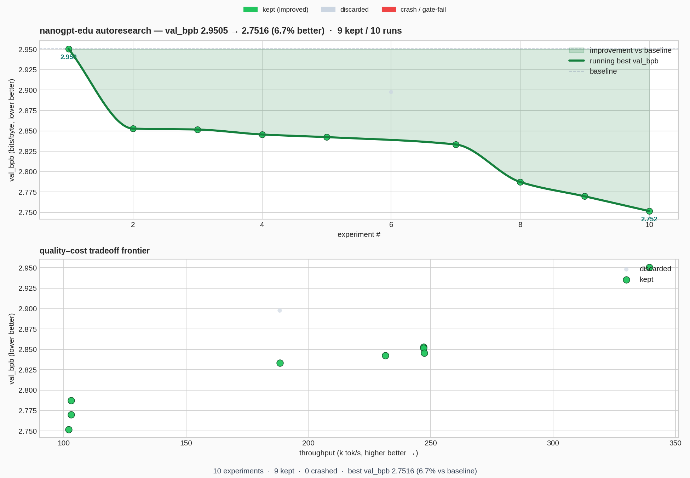

# `research/` — a tiny autonomous-research harness for nanogpt-edu

A self-contained "automated ML researcher" loop: an agent (LLM or the built-in
mutator) repeatedly edits **one file**, the harness trains it under a fixed
budget and measures it, and a keep/revert loop accumulates only the changes that
*measurably* lower validation **bits-per-byte**. Every number in the ledger and
chart below is a real GPU training run.

Inspired by [`karpathy/autoresearch`](https://github.com/karpathy/autoresearch)
and [`auto-improving-kernel`](https://github.com/jyotilakra92/auto-improving-kernel),
adapted to nanogpt-edu and improved in six concrete ways (below).



*Top: running-best `val_bpb` (smooth PCHIP through real improvements, 3-state
scatter for kept / discarded / crashed). Bottom: the quality–cost Pareto frontier
— `val_bpb` vs throughput — so a win that costs too much tok/s is visible.*

## Why this is GPU-only

The whole premise is running ~dozens of experiments unattended. On CPU that's a
day per knob — useless. The harness **asserts CUDA** up front (clear message if
absent). For single-config CPU/MPS play, use `train.py` with `configs/*.py`.

## The files

| File | Role | Editable? |
|------|------|-----------|
| `candidate.py` | the experiment: a `KNOBS` dict + optional `patch_model(model)` | **YES — the only file the agent edits** |
| `harness.py` | trains the candidate under a fixed budget, measures `val_bpb` + throughput/VRAM/params, runs gates | no (fixed laws) |
| `loop.py` | keep/revert driver; appends to `ledger.tsv`; `--auto N` self-mutates | no |
| `program.md` | the agent's brief (metric, rules, search space) | no |
| `seed_ledger.py` | one-off: runs a curated ladder of real configs to populate the ledger/chart | no |
| `plot.py` | renders `progress.png` (2-panel; scipy-free PCHIP fallback) | no |
| `ledger.tsv` | the audit trail every run appends to | generated |
| `progress.png` | the chart | generated |

## Quickstart

```bash
# from nanogpt-edu/ with the project venv (torch + CUDA)
.venv/bin/python research/seed_ledger.py     # populate a real ledger (~mins on a 5060 Ti)
.venv/bin/python research/plot.py            # -> research/progress.png

# one experiment on the current candidate.py:
.venv/bin/python research/loop.py --tokens 2000000

# autonomous demo (no LLM needed): N iterations, each applies a built-in
# knob mutation, keeps/reverts by measured val_bpb, commits kept edits:
.venv/bin/python research/loop.py --auto 8 --no-git
```

Drive it with a real agent by pointing your tool at `program.md` and letting it
edit `candidate.py`, then running `python loop.py` between edits.

## The metric: `val_bpb`

Validation **bits per byte** = cross-entropy (nats) / (ln 2 × bytes/token).
Lower is better; vocab-size-independent so architecture changes compare fairly.
For the char tokenizer bytes/token≈1, but the formula keeps a future BPE swap
honest (`--bytes-per-token`).

## Gates (what stops the agent cheating)

A kept experiment must pass all three:

1. **finite** — no NaN/Inf loss.
2. **descended** — val clearly below the ~`ln(vocab)` random-init ceiling, so a
   no-op / broken patch can't "pass".
3. **generalization** — train↔val gap under `max_gen_gap` (default 1.5), so a
   candidate can't win `val_bpb` by overfitting. This is nanogpt-edu's
   `tiny`-vs-`tiny_clean` overfitting lesson encoded as a guardrail.

## How this improves on autoresearch / auto-improving-kernel

1. **Token-budget by default, not wall-clock.** autoresearch fixes a 5-minute
   wall-clock budget and notes results then aren't comparable across machines.
   A *token* budget puts a 5060 Ti and an H100 on the **same** `val_bpb` curve
   — reproducible science across hardware (`--minutes` keeps the old mode).
2. **Multi-metric + a Pareto panel.** Not one scalar: `val_bpb` *and*
   throughput / VRAM / params, with a quality-vs-cost frontier so a win that
   tanks tok/s is obvious — the visual form of this repo's "sizing-fact" ethos.
3. **Anti-overfit gate.** A correctness bar for *training* (the analogue of
   autokernel's `correct: True`): you cannot win by memorising the train set.
4. **A seeded SOTA search space.** `KNOBS` exposes nanogpt-edu's real harvest
   (Muon, QK-norm, zero-init, untied embeddings, MTP, FlexAttention) so the
   agent starts from documented levers, not a blind search.
5. **Durable, cross-process keep/revert.** Because the agent edits
   `candidate.py` and re-runs `loop.py` as a *fresh process*, the revert target
   must be durable: kept edits are **git commits**, a discard/crash is
   `git checkout`. `--no-git` runs (single-process `--auto`) fall back to an
   in-memory snapshot, and an untracked `candidate.py` auto-falls-back with a
   warning \u2014 so revert is always correct, never a silent no-op.
6. **Determinism contract.** Fixed seeds + a fresh seeded eval generator make a
   candidate's `val_bpb` the same number every run — so a "win" is a real win,
   not RNG.

## Reproducible example (this checkout)

`seed_ledger.py` walked a 10-rung ladder on a single RTX 5060 Ti at a 2M-token
budget. It improved `val_bpb` **2.95 → 2.75 (≈6.7%)**, with one honest discard
(adding depth *regressed* at this token budget — real under-training signal), as
throughput fell 339k→102k tok/s and params grew 5.1M→14.2M — exactly the
tradeoff the Pareto panel exists to show. See `ledger.tsv` and `progress.png`.

> All runs use bf16 on a 5060 Ti (sm_120). The mechanism is the point; absolute
> numbers scale with budget and hardware.
